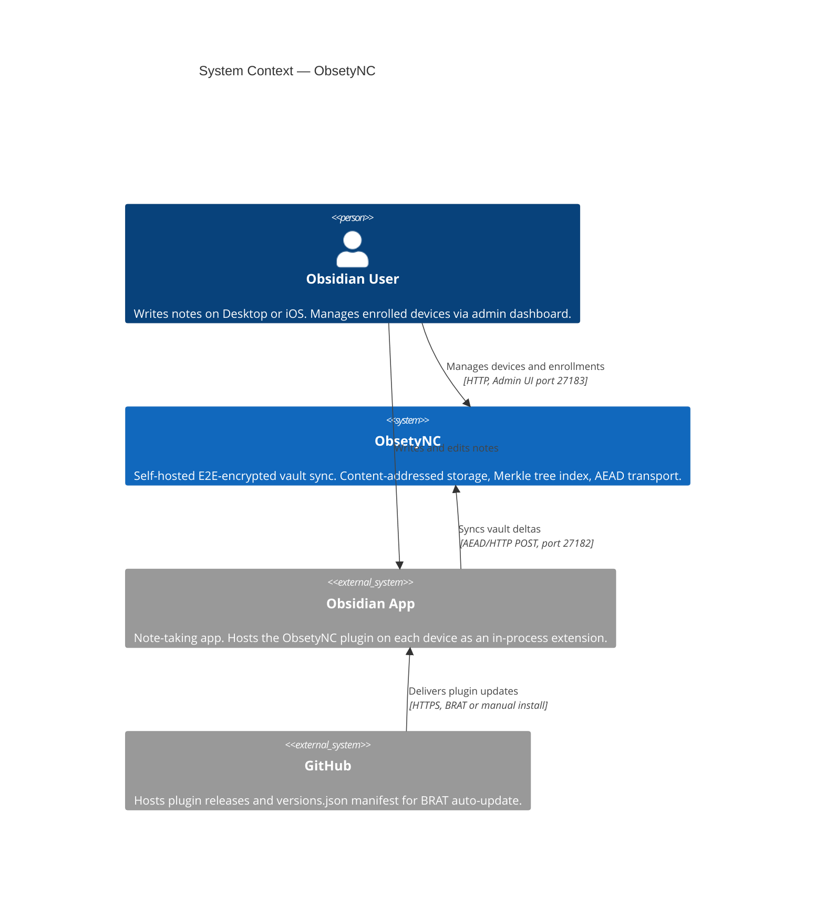

# C4 Level 1 — System Context

The Context diagram shows **who uses ObsetyNC and how it fits into the wider environment**. It deliberately hides all internal structure — that comes in Levels 2 and 3. The goal here is to answer: "What is this system, who talks to it, and what external systems does it depend on?"

---

---

## Elements

### People

| Person | Description |
|--------|-------------|
| **Obsidian User** | The sole human actor. Uses Obsidian on one or more devices to write and read notes. Also accesses the admin dashboard directly (in a browser) to enroll new devices or revoke old ones. |

### Systems

| System | Type | Description |
|--------|------|-------------|
| **ObsetyNC** | Internal | The system being described. Encompasses the Obsidian plugin (running on the user's device) and the sync server (running on a self-hosted VPS or home server). Provides encrypted vault synchronisation with content-addressed storage and Merkle-tree-based incremental diff. |
| **Obsidian App** | External | The desktop/mobile application that hosts the ObsetyNC plugin. The plugin runs inside Obsidian's process; it has no independent runtime. Obsidian itself is not modified — the plugin uses Obsidian's public plugin API. |
| **GitHub** | External | Hosts the repository and tagged plugin releases (main.js, manifest.json). The BRAT community plugin uses the `versions.json` manifest here to check for and install new ObsetyNC releases automatically. |

---

## Relationships

| From | To | Label | Notes |
|------|----|-------|-------|
| Obsidian User | Obsidian App | Writes and edits notes | Day-to-day note-taking. All vault changes originate here. |
| Obsidian App | ObsetyNC | Syncs vault deltas | The plugin initiates all sync traffic. Uses AEAD-encrypted HTTP POST on port 27182. No TLS — encryption is provided by an application-layer X25519 + AES-256-GCM envelope (see [transport.md](transport.md)). |
| Obsidian User | ObsetyNC | Manages devices and enrollments | The user opens a browser to the admin dashboard (port 27183) to create enrollment codes, list connected devices, and revoke access. This is plain HTTP — intended for access only within a trusted network or VPN. |
| GitHub | Obsidian App | Delivers plugin updates | BRAT auto-update polls GitHub for new releases. Manual install is also supported by copying files from a release ZIP. ObsetyNC itself does not call out to GitHub at runtime. |

---

## What is out of scope at this level

- How the plugin is built (TypeScript + WASM) — see Level 2
- How vault content is stored and indexed — see Level 2
- What HTTP routes exist on the sync server — see Level 3
- The cryptographic transport protocol — see [transport.md](transport.md)
