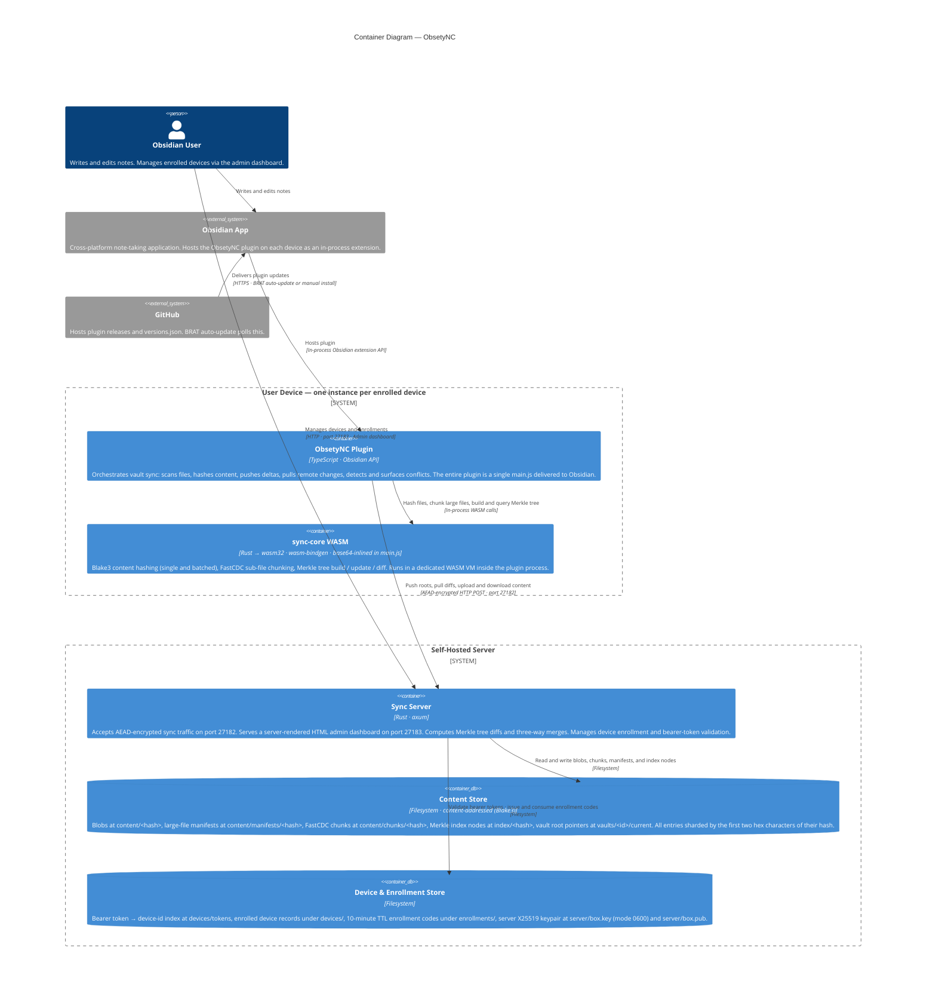

# C4 Level 2 — Containers

The Container diagram zooms inside ObsetyNC and shows **every separately runnable unit**: the plugin (one instance per enrolled device), the sync-core WASM module it carries, the sync server, and the two filesystem stores the server owns. External actors from Level 1 are shown again for context.

---

---

## Containers

### User Device *(one running instance per enrolled device)*

| Container | Technology | Description |
|-----------|-----------|-------------|
| **ObsetyNC Plugin** | TypeScript, Obsidian API | The sync client. Runs inside the Obsidian process as a standard community plugin. Responsible for everything on the client side: watching the vault for changes, orchestrating push and pull cycles, managing the four-layer recovery stack, and surfacing conflicts to the user. Delivered as a single `main.js` file (esbuild bundle) — no network install, no separate assets. |
| **sync-core WASM** | Rust compiled to wasm32-unknown-unknown, wasm-bindgen, base64-inlined in main.js | The cryptographic and algorithmic core. Compiled from `crates/sync-core` as a `.wasm` binary and inlined into `main.js` as a base64 constant at build time. This bypasses iOS WKWebView's Content Security Policy, which blocks dynamic `eval()` / `new Function()` calls that would otherwise be needed to load a separate `.wasm` file. Exposes a `WasmTree` class and a set of free functions for hashing and chunking. |

**Why WASM?** The Merkle tree structure and Blake3 / FastCDC algorithms need to run identically on desktop and iOS. Shipping them as WASM means one Rust implementation, no platform-specific JS, and a bounded memory profile (the plugin streams files in 64 KB slices rather than loading them whole).

---

### Self-Hosted Server

| Container | Technology | Description |
|-----------|-----------|-------------|
| **Sync Server** | Rust, axum | A single statically-linked binary. Runs two axum HTTP servers: the **sync API** on port 27182 (all traffic is AEAD-encrypted at the application layer — no TLS required) and the **admin dashboard** on port 27183 (plain HTTP, intended for trusted-network access only). The sync API is fronted by a `secure_envelope` middleware that decrypts each incoming request and encrypts each outgoing response using the server's X25519 private key. Merkle tree diffs and three-way merges run inside the same process using the native (non-WASM) build of `sync-core`. |
| **Content Store** | Local filesystem, content-addressed | Immutable, content-addressed blob store. Everything is keyed by the Blake3 hash of its contents, so the same bytes are stored exactly once regardless of filename or version. Sharding by `hash[0:2]` keeps any single directory well under filesystem limits even at millions of files. The `vaults/<id>/current` pointer is the only mutable file — it holds the hex hash of the current root node. |
| **Device & Enrollment Store** | Local filesystem | Mutable operational state. The bearer token index (`devices/tokens`) is consulted on every sync request. Enrollment codes are written with a creation timestamp and checked for expiry (10-minute TTL) at claim time. The server's X25519 private key lives here at mode 0600 and is loaded once at startup. |

---

## Key Design Choices Visible at This Level

**Single binary, two ports.** Splitting sync (27182) and admin (27183) onto separate TCP ports lets operators apply different firewall rules: sync traffic can be open to the internet (it is encrypted at the application layer), while the admin port can be restricted to localhost or a VPN. No separate admin process to manage.

**WASM inlined, not fetched.** The WASM binary is base64-encoded into `main.js` at build time. Obsidian's plugin loader delivers a single file; there is no second HTTP request, no Content-Security-Policy issue on iOS, and no possibility of the `.wasm` file arriving separately from the `.js` glue.

**Two separate data stores.** Content and device state are kept in sibling directories under one data root (`--data-dir`). The content store is append-only and safe to back up with a file copy at any time (hashes are immutable). The device store is small and mutable. Keeping them separate simplifies backup and restore: you can snapshot `content/` independently of `devices/`.

**No TLS on the sync port.** The application-layer AEAD envelope (X25519 ECDH + HKDF + AES-256-GCM, documented in [transport.md](transport.md)) provides confidentiality, integrity, and forward secrecy for every request without requiring certificate management. This was driven by iOS: `requestUrl` does not support client certificates, and users cannot reliably install private CA certs on iOS devices.

---

## What is out of scope at this level

- The internal modules of the plugin (SyncEngine, PushEngine, PullEngine, etc.) — see [c4-3-plugin.md](c4-3-plugin.md)
- The internal modules of the Sync Server (SecureEnvelope, BlobStorage, MerkleEngine, etc.) — see [c4-3-server.md](c4-3-server.md)
- The internal modules of sync-core WASM (TreeBuilder, DiffEngine, FastCDC, etc.) — see [c4-3-wasm.md](c4-3-wasm.md)
- The cryptographic wire format — see [transport.md](transport.md)
