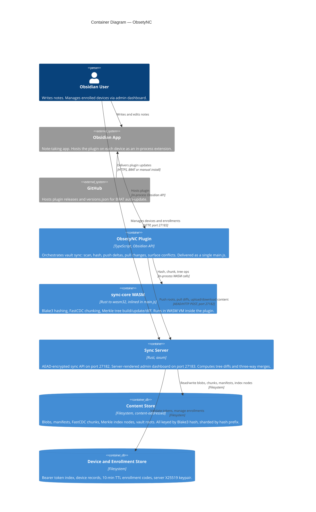

# C4 Level 2 — Containers

The Container diagram zooms inside ObsetyNC and shows **every separately runnable unit**: the plugin (one instance per enrolled device), the sync-core WASM module it carries, the sync server, and the two filesystem stores the server owns. External actors from Level 1 are shown again for context.

---

```mermaid
C4Container
    title Container Diagram — ObsetyNC

    Person(user, "Obsidian User", "Writes notes. Manages enrolled devices via admin dashboard.")

    System_Ext(obsidian_app, "Obsidian App", "Note-taking app. Hosts the plugin on each device as an in-process extension.")
    System_Ext(github, "GitHub", "Hosts plugin releases and versions.json for BRAT auto-update.")

    Container(plugin, "ObsetyNC Plugin", "TypeScript, Obsidian API", "Orchestrates vault sync: scan, hash, push deltas, pull changes, surface conflicts. Delivered as a single main.js.")
    Container(wasm_core, "sync-core WASM", "Rust to wasm32, inlined in main.js", "Blake3 hashing, FastCDC chunking, Merkle tree build/update/diff. Runs in WASM VM inside the plugin.")
    Container(sync_server, "Sync Server", "Rust, axum", "AEAD-encrypted sync API on port 27182. Server-rendered admin dashboard on port 27183. Computes tree diffs and three-way merges.")
    ContainerDb(content_store, "Content Store", "Filesystem, content-addressed", "Blobs, manifests, FastCDC chunks, Merkle index nodes, vault roots. All keyed by Blake3 hash, sharded by hash prefix.")
    ContainerDb(device_store, "Device and Enrollment Store", "Filesystem", "Bearer token index, device records, 10-min TTL enrollment codes, server X25519 keypair.")

    Rel(user, obsidian_app, "Writes and edits notes")
    Rel(user, sync_server, "Manages devices and enrollments", "HTTP, port 27183")
    Rel(obsidian_app, plugin, "Hosts plugin", "In-process Obsidian API")
    Rel(plugin, wasm_core, "Hash, chunk, tree ops", "In-process WASM calls")
    Rel(plugin, sync_server, "Push roots, pull diffs, upload/download content", "AEAD/HTTP POST, port 27182")
    Rel(github, obsidian_app, "Delivers plugin updates", "HTTPS, BRAT or manual install")
    Rel(sync_server, content_store, "Read/write blobs, chunks, manifests, index nodes", "Filesystem")
    Rel(sync_server, device_store, "Validate tokens, manage enrollments", "Filesystem")
```

---

## Containers

### User Device *(one running instance per enrolled device)*

| Container | Technology | Description |
|-----------|-----------|-------------|
| **ObsetyNC Plugin** | TypeScript, Obsidian API | The sync client. Runs inside the Obsidian process as a standard community plugin. Responsible for everything on the client side: watching the vault for changes, orchestrating push and pull cycles, managing the four-layer recovery stack, and surfacing conflicts to the user. Delivered as a single `main.js` file (esbuild bundle) — no network install, no separate assets. |
| **sync-core WASM** | Rust compiled to scalar + SIMD wasm32-unknown-unknown variants, wasm-bindgen, base64-inlined in main.js | The cryptographic and algorithmic core. Runtime validation selects the SIMD `blake3` fast path when the WebView supports `simd128`, otherwise the universal scalar build is used. Both are inlined into `main.js`, bypassing iOS WKWebView restrictions on dynamic code loading. Exposes a `WasmTree` class and hashing/chunking functions with identical output in both modes. |

**Why WASM?** The Merkle tree structure and Blake3 / FastCDC algorithms need to run identically on desktop and iOS. WASM gives one Rust implementation and bounded *WASM* bridge memory through 64 KiB feeds. Desktop can also stream the source file; Obsidian mobile cannot ranged-read a local source, so mobile upload still holds one capped whole-file JS buffer. Chunked downloads remain genuinely bounded.

---

### Self-Hosted Server

| Container | Technology | Description |
|-----------|-----------|-------------|
| **Sync Server** | Rust, axum | A single statically-linked binary. Runs two axum HTTP servers: the **sync API** on port 27182 (all traffic is AEAD-encrypted at the application layer — no TLS required) and the **admin dashboard** on port 27183 (plain HTTP, intended for trusted-network access only). The sync API is fronted by a `secure_envelope` middleware that decrypts each incoming request and encrypts each outgoing response using the server's X25519 private key. Merkle tree diffs and three-way merges run inside the same process using the native (non-WASM) build of `sync-core`. |
| **Content Store** | Local filesystem, content-addressed | File blobs, FastCDC chunks, and Merkle leaf/internal nodes use exact Blake3 byte addresses and two-character sharding. Manifests use the reconstructed file hash; per-vault roots use a semantic hash of ordered child references, while history metadata stays outside identity. Valid root-history records are first-write immutable and `vaults/<id>/current` is the mutable pointer to the active state. |
| **Device & Enrollment Store** | Local filesystem | Mutable operational state. The bearer token index (`devices/tokens`) is consulted on every sync request. Enrollment codes are written with a creation timestamp and checked for expiry (10-minute TTL) at claim time. The server's X25519 private key lives here at mode 0600 and is loaded once at startup. |

---

## Key Design Choices Visible at This Level

**Single binary, two ports.** Splitting sync (27182) and admin (27183) onto separate TCP ports lets operators apply different firewall rules: sync traffic can be open to the internet (it is encrypted at the application layer), while the admin port can be restricted to localhost or a VPN. No separate admin process to manage.

**WASM inlined, not fetched.** The WASM binary is base64-encoded into `main.js` at build time. Obsidian's plugin loader delivers a single file; there is no second HTTP request, no Content-Security-Policy issue on iOS, and no possibility of the `.wasm` file arriving separately from the `.js` glue.

**Two separate data stores.** Content and device state are kept in sibling directories under one data root (`--data-dir`). Content-addressed objects are immutable and individually promoted atomically, while current-root pointers and device/replay state are mutable. Use a filesystem snapshot or briefly quiesce the server for a coherent full backup; copying arbitrary subtrees at unrelated instants is not a transactional snapshot.

**No TLS on the sync port.** The application-layer AEAD envelope (X25519 ECDH + HKDF + AES-256-GCM, documented in [transport.md](transport.md)) provides body confidentiality/integrity and window-bounded forward secrecy for ordinary requests without certificate management. It does not hide paths, sizes, timing, or IP metadata, and the separate plaintext admin port still requires a trusted network/VPN/tunnel.

---

## What is out of scope at this level

- The internal modules of the plugin (ObsetyncSyncEngine, PushEngine, PullEngine, etc.) — see [c4-3-plugin.md](c4-3-plugin.md)
- The internal modules of the Sync Server (SecureEnvelope, BlobStorage, MerkleEngine, etc.) — see [c4-3-server.md](c4-3-server.md)
- The internal modules of sync-core WASM (TreeBuilder, DiffEngine, FastCDC, etc.) — see [c4-3-wasm.md](c4-3-wasm.md)
- The cryptographic wire format — see [transport.md](transport.md)
