```mermaid
C4Component
    title Component Diagram — ObsetyNC Plugin

    Person(user, "Obsidian User", "Configures plugin. Triggers manual sync. Resolves conflicts.")

    System_Ext(obsidian_app, "Obsidian App", "Loads and unloads the plugin. Fires vault file-change events.")

    Container_Boundary(b_plugin, "ObsetyNC Plugin · TypeScript · main.js") {
        Component(sync_plugin, "ObsetyncPlugin", "main.ts", "Obsidian Plugin entry point. Initialises WASM, wires all components together, registers commands (sync-now, full-rescan, show-conflicts), manages status bar.")
        Component(sync_engine, "ObsetyncSyncEngine", "sync.ts", "Core orchestrator. 4-layer recovery on startup (live events → journal → mtime scan → full scan). Periodic 30s pull timer. forceSync: pull → reconcileContent → push. Holds localRootHash.")
        Component(push_engine, "PushEngine", "push.ts", "Streaming 5-phase push: A) hash resolution (wasm_hash_batch for small files, wasm_chunk_file for large); B) batch-check server; C) upload only missing; D) tree.update_batch (one WASM call); E) putRoot. STREAM_BATCH=50, READ_CONCURRENCY=4.")
        Component(pull_engine, "PullEngine", "pull.ts", "Fetches server-computed deltas and applies them. Per-file 3-tier resolution: tier-1 sync-base cache hit (zero work), tier-2 local hash verify via WASM (repair sync-base, skip download), tier-3 actual download. DOWNLOAD_CONCURRENCY=6.")
        Component(sync_api, "ObsetyncApi", "api.ts", "HTTP client for all sync API endpoints. Transparently wraps every request and response in the AEAD envelope via ObsetyncSecureChannel. Obsidian requestUrl is the only network primitive used (works identically on desktop and iOS).")
        Component(secure_channel, "ObsetyncSecureChannel", "secure.ts", "Per-request X25519 ECDH + HKDF-SHA256 + AES-256-GCM. Generates a fresh ephemeral keypair for every HTTP call. Encrypts [bearer_token || body] into the request, decrypts the response. No TLS, no CA.")
        Component(sync_base, "ObsetyncSyncBase", "sync-base.ts", "Persists the last-successfully-synced state for every file: path → {hash, mtime, size} and lastSyncTimestamp. Loaded from and saved to .obsidian/plugins/obsetync/sync-base.json. Acts as the common ancestor for conflict detection and pull tier-1/2.")
        Component(journal, "ObsetyncJournal", "journal.ts", "Append-only ring buffer of vault events (create/modify/delete/rename). Written on every vault file-change event before the sync. Read on startup to recover changes that were journaled but not yet pushed (Layer 2 of D-005).")
        Component(platform_io, "PlatformIO", "platform.ts", "Abstracts the Obsidian vault file API for desktop vs iOS. Provides: readFile (streaming in 64 KB slices), writeFile, deleteFile, renameFile, stat, statBulk, mkdir. Hides WKWebView and Electron API differences.")
        Component(conflict_modal, "ObsetyncConflictModal", "conflict-ui.ts", "Modal dialog that lists three-way merge conflicts found in the vault (files renamed to *.conflict by the server's merge engine). Lets the user inspect and resolve each conflict.")
        Component(settings_tab, "ObsetyncSettingTab", "settings.ts", "Obsidian settings tab. Server URL, vault ID, device name, bearer token, sync interval, reconcile toggle, .obsidian sync option. Also surfaces debug log and enrolled-device list.")
        Component(debug_panel, "ObsetyncDebugLog + ObsetyncDebugModal", "debug-log.ts · debug-modal.ts", "Installs a console.log interceptor at startup to capture every [obsetync] log line into a fixed-size ring buffer. A modal command surfaces them — essential on iOS where there is no developer console.")
    }

    Container_Ext(wasm_core, "sync-core WASM", "Rust → wasm32 · inlined in main.js", "Blake3 hashing, FastCDC chunking, Merkle tree build / update / query.")
    Container_Ext(sync_server, "Sync Server", "Rust · axum · port 27182", "Sync API: diff, getRoot, getContent, putContent, putRoot, etc.")

    Rel(obsidian_app, sync_plugin, "Loads plugin · fires vault events", "Obsidian Plugin API")
    Rel(user, settings_tab, "Configures server URL, vault ID, bearer token")
    Rel(user, conflict_modal, "Reviews and resolves conflicts")

    Rel(sync_plugin, sync_engine, "Creates and starts on load · stops on unload")
    Rel(sync_plugin, conflict_modal, "Opens on 'show-conflicts' command", "findConflicts(syncBase)")
    Rel(sync_plugin, debug_panel, "Installs log interceptor at startup", "debugLog.install()")

    Rel(sync_engine, push_engine, "Calls push() on pending changes", "api · io · syncBase · wasm · tree")
    Rel(sync_engine, pull_engine, "Calls pull() on startup and 30s timer", "api · io · syncBase · localRootHash · wasm")
    Rel(sync_engine, sync_api, "reconcileContent: checkChunks · checkContent · checkManifests · putChunk · putBlob")
    Rel(sync_engine, sync_base, "allPaths() · getEntry() — bootstrap tree for reconcile")
    Rel(sync_engine, journal, "Appends vault events · replays on crash recovery")
    Rel(sync_engine, wasm_core, "reconcile: wasm_tree_chunk_hashes · wasm_tree_get_chunk · tree.build_from_entries")

    Rel(push_engine, sync_api, "checkContent · checkChunks · putBlob · putChunk · putRoot")
    Rel(push_engine, platform_io, "Reads file bytes in batches (READ_CONCURRENCY=4)")
    Rel(push_engine, sync_base, "Reads hash/mtime/size · saves after successful push")
    Rel(push_engine, wasm_core, "wasm_hash_batch (small files) · wasm_chunk_file (large) · tree.update_batch · tree.root_bytes")

    Rel(pull_engine, sync_api, "getDiff · getContent · getContentChunk · getManifest · getRoot")
    Rel(pull_engine, platform_io, "writeFile · renameFile · deleteFile · stat · mkdir")
    Rel(pull_engine, sync_base, "Tier-1: getEntry() cache check · tier-2: setEntry() repair · save() after pull")
    Rel(pull_engine, wasm_core, "Tier-2: hashFileStreaming (64 KB slices) · wasm_root_hash_from_bytes")

    Rel(sync_api, secure_channel, "Encrypts every request body · decrypts every response")
    Rel(sync_api, sync_server, "AEAD-encrypted HTTP POST", "plain HTTP · port 27182")

    UpdateLayoutConfig($c4ShapeInRow="4", $c4BoundaryInRow="1")
```

# C4 Level 3 — Plugin Components

This diagram zooms inside the **ObsetyNC Plugin** container from Level 2 and shows every significant TypeScript module, what each one does, and how they call each other. External containers (sync-core WASM, Sync Server) are shown at the boundary so data-flow arrows are complete.

---



---

## Components

| Component | Source file | Role |
|-----------|-------------|------|
| **ObsetyncPlugin** | `main.ts` | Obsidian `Plugin` subclass. `onload()` initialises WASM synchronously (base64 Uint8Array → `initWasm()`), creates all component instances, starts `ObsetyncSyncEngine`, registers three commands, adds the status-bar element. `onunload()` stops the engine and removes listeners. |
| **ObsetyncSyncEngine** | `sync.ts` | The orchestrator. Holds `localRootHash` (the client's view of what is on the server), a `pendingChanges: FileChange[]` queue, and the 30-second interval timer. Startup sequence: `pullRemote → recoverFromJournal → partialMtimeScan → attachVaultListeners`. `forceSync` (Sync Now command) runs `pull → reconcileContent → pushPending`. |
| **PushEngine** | `push.ts` | A top-level async `push()` function (not a class). Processes `FileChange[]` in batches of 50. Per batch: (A) hash unknown small files in one `wasm_hash_batch` call, large files via `wasm_chunk_file`; (B) two HTTP requests to learn what the server is missing; (C) upload only the missing pieces; (D) collect tree entry updates. After all batches: one `tree.update_batch` WASM call and one `putRoot`. |
| **PullEngine** | `pull.ts` | A top-level async `pull()` function. Gets `FileDelta[]` from the server's `getDiff` endpoint. Groups them by type (rename, delete, modify, add). For add/modify: runs `applyContentDelta` in parallel batches of 6, using the 3-tier resolution strategy. Saves `ObsetyncSyncBase` and returns the new root hash. |
| **ObsetyncApi** | `api.ts` | `class ObsetyncApi`. One method per server endpoint: `ping`, `getDiff`, `getRoot`, `putRoot`, `getContent`, `putBlob`, `getContentChunk`, `putChunk`, `getManifest`, `checkContent`, `checkChunks`, `checkManifests`. Normalises `https://` URLs to `http://` for legacy compat. Lazily initialises `ObsetyncSecureChannel` on first encrypted request. |
| **ObsetyncSecureChannel** | `secure.ts` | `class ObsetyncSecureChannel`. `encrypt(method, path, plaintext)` → ciphertext header. `decrypt(ciphertext)` → plaintext. Per-call flow: generate ephemeral X25519 keypair → ECDH with server pubkey → HKDF-SHA256 with nonce salt to derive request key and response key → AES-256-GCM encrypt with AAD `"obsetync/v1" ‖ method ‖ path`. Uses `@noble/curves` (no SubtleCrypto dependency, iOS compatible). |
| **ObsetyncSyncBase** | `sync-base.ts` | `class ObsetyncSyncBase`. In-memory map `path → {hash, mtime, size}` plus `lastSyncTimestamp`. Loaded from `.obsidian/plugins/obsetync/sync-base.json` on startup. `dirty` flag prevents unnecessary writes. `allPaths()` is the source of truth for reconcile and conflict detection. |
| **ObsetyncJournal** | `journal.ts` | Append-only log of `JournalEntry` records (path, action, timestamp). Loaded on startup; unprocessed entries are replayed before the mtime scan. Entries are removed once their content has been successfully pushed. Prevents data loss across app restarts. |
| **PlatformIO** | `platform.ts` | `class PlatformIO` with a `createPlatformIO(app)` factory. Uniform interface over `app.vault.adapter`. Key difference handled: on iOS, `adapter.readBinary()` must be used instead of `adapter.read()`; streaming is implemented manually in 64 KB slices to keep WASM heap bounded. `statBulk()` uses Obsidian's `getFiles()` cache — no filesystem traversal. |
| **ObsetyncConflictModal** | `conflict-ui.ts` | `class ObsetyncConflictModal extends Modal`. `findConflicts(syncBase)` scans for `*.conflict` files (created by the server's merge engine when both sides changed the same file). The modal renders a diff and offers "Keep mine", "Keep server", or "Keep both" per conflict. |
| **ObsetyncSettingTab** | `settings.ts` | `class ObsetyncSettingTab extends PluginSettingTab`. Four tabs: Connection (server URL, vault ID, device name, bearer token), Sync (interval, priority, `.obsidian/` toggle), Reconcile (manual trigger + status), Debug (last errors, debug log viewer). Calls `ObsetyncSyncEngine.reconcileContent()` when the user hits the reconcile button. |
| **ObsetyncDebugLog + ObsetyncDebugModal** | `debug-log.ts` · `debug-modal.ts` | `debugLog.install()` monkey-patches `console.log` and `console.warn` to also push matching lines into a fixed-size ring buffer. `ObsetyncDebugModal` renders the buffer in a scrollable modal. Critical on iOS where there is no accessible developer console and log lines would otherwise be invisible. |

---

## Key Data Flows

### Startup (every time Obsidian opens)
```
ObsetyncPlugin.onload
  → initWasm(wasmBytes)               # WASM boot
  → ObsetyncSyncBase.load() + ObsetyncJournal.load()  # read disk state
  → ObsetyncSyncEngine.start()
      → pullRemote()                  # pull.ts → ObsetyncApi → ObsetyncSecureChannel → server
      → recoverFromJournal()          # replay journal → push.ts
      → partialMtimeScan()            # scan vault → push.ts
      → attachVaultListeners()        # Obsidian vault events → journal + pendingChanges
      → setInterval(pullRemote, 30s)  # periodic pull
```

### Sync Now (forceSync)
```
ObsetyncSyncEngine.forceSync
  → pullRemote()            # pull latest deltas (pull.ts)
  → reconcileContent()      # verify server has everything sync-base claims
      → wasm_tree_chunk_hashes  → ObsetyncApi.checkChunks
      → ObsetyncApi.checkContent    (small files, 1000/batch)
      → ObsetyncApi.checkManifests  (large files, 1000/batch)
      → ObsetyncApi.putChunk / putBlob for anything missing
  → pushPending()           # push.ts for any dirty local changes
```

### Pull (applyDeltas — three tiers)
```
PullEngine: for each added/modified file delta:
  tier-1  → ObsetyncSyncBase.getEntry()           → matches? zero work
  tier-2  → PlatformIO.readFile(64KB)     → wasm.Hasher → matches? repair ObsetyncSyncBase, skip download
  tier-3  → ObsetyncApi.getContent / getManifest + getContentChunk → PlatformIO.writeFile
```

---

## What is out of scope at this level

- The internals of sync-core WASM (TreeBuilder, DiffEngine, FastCDCChunker, etc.) — see [c4-3-wasm.md](c4-3-wasm.md)
- The sync server's component breakdown — see [c4-3-server.md](c4-3-server.md)
- The wire-level cryptographic protocol — see [transport.md](transport.md)
