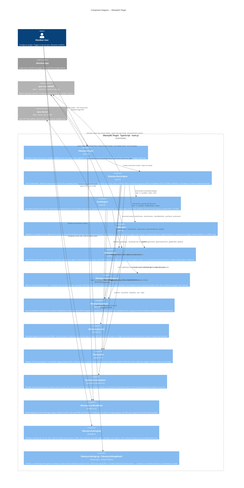

# C4 Level 3 — Plugin Components

This diagram zooms inside the **ObsetyNC Plugin** container from Level 2 and shows every significant TypeScript module, what each one does, and how they call each other. External containers (sync-core WASM, Sync Server) are shown at the boundary so data-flow arrows are complete.

---


```mermaid
C4Component
    title Component Diagram — ObsetyNC Plugin

    Person(user, "Obsidian User", "Configures plugin. Triggers manual sync. Resolves conflicts.")

    System_Ext(obsidian_app, "Obsidian App", "Loads and unloads the plugin. Fires vault file-change events.")

    Container_Boundary(b_plugin, "ObsetyNC Plugin · TypeScript · main.js") {
        Component(sync_plugin, "ObsetyncPlugin", "main.ts", "Obsidian Plugin entry point. Initialises WASM, wires all components together, registers commands (sync-now, full-rescan, show-conflicts), manages status bar.")
        Component(sync_engine, "ObsetyncSyncEngine", "sync.ts", "Core orchestrator. Attaches listeners before the first network await, coalesces one metadata-only dirty record per path, protects edits arriving during pull, audits all metadata drift and offline deletions, and keeps an honest verified tree base.")
        Component(push_engine, "PushEngine", "push.ts", "Bounded 5-phase push: batch hash/check, ordered byte/count-bounded object packs, streaming FastCDC planning, one tree.update_batch, then putRoot. Chunk records always precede their manifest.")
        Component(pull_engine, "PullEngine", "pull.ts", "Validates and applies server deltas with cache/local-hash/bulk-download tiers. Small misses and sub-1 MiB chunks use bounded cursor pages; every object is hashed before an apply/checkpoint. Unknown local bytes remain visible as a conflict copy.")
        Component(sync_api, "ObsetyncApi", "api.ts", "AEAD HTTP client with authenticated capability negotiation. Bulk-v1 uses strict binary codecs and 8 MiB desktop / 2 MiB mobile retention budgets; absent or oversized fast paths fall back to stable single-object endpoints.")
        Component(secure_channel, "ObsetyncSecureChannel", "secure.ts", "Wire-v2 channel: pinned-static + rotating-server double DH, per-message HKDF/AES-GCM keys, encrypted bearer/sequence/status, and request-nonce response binding. One client ephemeral keypair per channel.")
        Component(sync_base, "ObsetyncSyncBase", "sync-base.ts", "Last-synced path metadata plus verified treeBaseRoot. Atomic rotated JSON snapshot + append-only idempotent WAL checkpoints let a large pull resume without replaying completed batches.")
        Component(journal, "ObsetyncJournal", "journal.ts", "Serialized append-only event/ack WAL. Exact per-path id watermarks cannot erase a newer edit while an older push is in flight; torn tails are recovered and records compact periodically.")
        Component(platform_io, "PlatformIO", "platform.ts", "Adapter I/O, binary append, recoverable staging replacement, cached bulk stat, and desktop absolute-path streaming. Mobile whole-file source reads are capped; restore writes are chunked.")
        Component(operation_checkpoint, "OperationCheckpoint", "operation-checkpoint.ts", "Durable active-phase/progress breadcrumb for pull, push, reconcile, and full scan. An orphaned marker on next launch identifies where an iOS renderer/Jetsam termination occurred.")
        Component(conflict_modal, "ObsetyncConflictModal", "conflict-ui.ts", "Modal dialog that lists three-way merge conflicts found in the vault (files renamed to *.conflict by the server's merge engine). Lets the user inspect and resolve each conflict.")
        Component(settings_tab, "ObsetyncSettingTab", "settings.ts", "Obsidian settings tab. Server URL, vault ID, device name, bearer token, sync interval, reconcile toggle, .obsidian sync option. Also surfaces debug log and enrolled-device list.")
        Component(debug_panel, "ObsetyncDebugLog + ObsetyncDebugModal", "debug-log.ts · debug-modal.ts", "Installs a console.log interceptor at startup to capture every [obsetync] log line into a fixed-size ring buffer. A modal command surfaces them — essential on iOS where there is no developer console.")
    }

    Container_Ext(wasm_core, "sync-core WASM", "Rust → wasm32 · inlined in main.js", "Blake3 hashing, FastCDC chunking, Merkle tree build / update / query.")
    Container_Ext(sync_server, "Sync Server", "Rust · axum · port 27182", "Sync API: diff, getRoot, getContent, putContent, putRoot, etc.")

    Rel(obsidian_app, sync_plugin, "Loads plugin · fires vault events", "Obsidian Plugin API")
    Rel(user, settings_tab, "Configures server URL, vault ID, bearer token")
    Rel(user, conflict_modal, "Reviews and resolves conflicts")

    Rel(sync_plugin, sync_engine, "Creates and starts on load · stops on unload")
    Rel(sync_plugin, conflict_modal, "Opens on 'show-conflicts' command", "findConflicts(syncBase)")
    Rel(sync_plugin, debug_panel, "Installs log interceptor at startup", "debugLog.install()")

    Rel(sync_engine, push_engine, "Calls push() on pending changes", "api · io · syncBase · wasm · tree")
    Rel(sync_engine, pull_engine, "Calls pull() on startup and 30s timer", "api · io · syncBase · localRootHash · wasm")
    Rel(sync_engine, sync_api, "reconcileContent: checkChunks · checkContent · checkManifests · putChunk · putContent")
    Rel(sync_engine, sync_base, "allPaths() · getEntry() — bootstrap tree for reconcile")
    Rel(sync_engine, journal, "Appends vault events · replays on crash recovery")
    Rel(sync_engine, operation_checkpoint, "Begins, progresses, and completes durable phase markers")
    Rel(sync_engine, wasm_core, "reconcile: wasm_tree_chunk_hashes · wasm_tree_get_chunk · tree.build_from_entries")

    Rel(push_engine, sync_api, "checkContent · checkChunks · putContent · putContentChunk · putRoot")
    Rel(push_engine, platform_io, "Reads file bytes in batches (READ_CONCURRENCY=4)")
    Rel(push_engine, sync_base, "Reads hash/mtime/size · saves after successful push")
    Rel(push_engine, wasm_core, "wasm_hash_batch (small files) · WasmChunker (large) · tree.update_batch · tree.root_bytes")

    Rel(pull_engine, sync_api, "getDiff · getContent · getContentChunk · getManifest · getRoot")
    Rel(pull_engine, platform_io, "writeFile · renameFile · deleteFile · stat · mkdir")
    Rel(pull_engine, sync_base, "Tier-1: getEntry() cache check · tier-2: setEntry() repair · save() after pull")
    Rel(pull_engine, wasm_core, "Tier-2: hashFileStreaming (64 KB slices) · wasm_root_hash_from_bytes")

    Rel(sync_api, secure_channel, "Encrypts every request body · decrypts every response")
    Rel(sync_api, sync_server, "AEAD-encrypted HTTP POST", "plain HTTP · port 27182")

    UpdateLayoutConfig($c4ShapeInRow="4", $c4BoundaryInRow="1")
```

---

## Components

| Component | Source file | Role |
|-----------|-------------|------|
| **ObsetyncPlugin** | `main.ts` | Obsidian `Plugin` subclass. `onload()` initialises WASM synchronously (base64 Uint8Array → `initWasm()`), creates all component instances, starts `ObsetyncSyncEngine`, registers three commands, adds the status-bar element. `onunload()` stops the engine and removes listeners. |
| **ObsetyncSyncEngine** | `sync.ts` | The orchestrator. Separates last-observed server root from the verified tree merge base, coalesces dirty paths in `DirtyPathSet`, and serializes mutation of the WASM tree. Startup sequence: `attachVaultListeners → pullRemote → recoverFromJournal → metadataScan`; `forceSync` runs `pull → reconcileContent → pushPending`. The scan compares every current stat with sync-base instead of trusting wall-clock direction, so copied-in files with old mtimes, backwards mtimes, and offline deletions are found. |
| **PushEngine** | `push.ts` | Processes byte-bounded small-file batches and each large file alone. Missing small blobs, chunks, manifests, and index nodes are submitted as ordered records; the API splits them by the negotiated byte/count caps while preserving chunk-before-manifest dependencies. Progress and tree state advance only after every record receives a stored/already-present ACK, and one `putRoot` commits the candidate. |
| **PullEngine** | `pull.ts` | Gets a validated `FileDelta[]`, safely crosses ignore boundaries, and resolves cache/local-hash tiers before collecting genuine misses. Small files use bounded cursor download pages with duplicate hashes fetched once. Large restores batch only eligible sub-1 MiB chunks, verify each chunk independently, and durably checkpoint each append; larger legacy chunks stay one-at-a-time. Unknown overwrite targets move to a visible conflict path, and only proved-complete operations advance sync-base. |
| **ObsetyncApi** | `api.ts` | Every protected call reserves a durable sequence, tunnels its semantic method through wire POST, and decrypts the semantic response. Once per cached session it discovers authenticated capabilities; `bulk-http-v1` is locally capped at 256 objects and 8 MiB on desktop or 2 MiB on mobile. Strict codecs reject malformed packs/pages, mixed ACKs distinguish permanent from retryable failures, and missing/old endpoints or oversized records transparently use the stable single-object API. |
| **ObsetyncSecureChannel** | `secure.ts` | Wire-v2 client. Combines DH against the pinned static server key and rotating memory-only server key, derives per-message AES-GCM keys with HKDF-SHA256, binds method/path and request nonce in AAD, carries durable sequences, and decrypts the encrypted semantic status. Uses `@noble/curves` for X25519 and SubtleCrypto for HKDF/AES-GCM; see `transport.md`. |
| **ObsetyncSyncBase** | `sync-base.ts` | In-memory `path → {hash, local mtime, size, optional server tree mtime}` plus timestamp and verified `treeBaseRoot`. Batch mutations first append to `sync-base.wal.ndjson`; `save()` rotates `.next → main` with `.bak` recovery and only then clears the idempotent WAL. |
| **ObsetyncJournal** | `journal.ts` | Append-only NDJSON event/ack WAL with monotonic ids. A successful push appends exact per-path acknowledgement watermarks, so a later edit on the same path survives. Parseable records before a torn final append recover on startup; periodic compaction keeps only pending final states. |
| **PlatformIO** | `platform.ts` | Uniform adapter I/O including `appendFile` and recoverable `replaceFile`. Desktop can expose an absolute path for true 64 KiB streaming hashes. Mobile has no ranged DataAdapter read, so source files are whole-buffer and capped at 128 MiB; chunked restore remains bounded. |
| **OperationCheckpoint** | `operation-checkpoint.ts` | Persists the current phase and rate-limited progress. Normal completion removes the active marker; startup promotes an orphan to `last-interruption.json`, making otherwise silent iOS renderer kills diagnosable. |
| **ObsetyncConflictModal** | `conflict-ui.ts` | `class ObsetyncConflictModal extends Modal`. `findConflicts(syncBase)` scans for `*.conflict` files (created by the server's merge engine when both sides changed the same file). The modal renders a diff and offers "Keep mine", "Keep server", or "Keep both" per conflict. |
| **ObsetyncSettingTab** | `settings.ts` | `class ObsetyncSettingTab extends PluginSettingTab`. Four tabs: Connection (server URL, vault ID, device name, bearer token), Sync (interval, priority, `.obsidian/` toggle), Reconcile (manual trigger + status), Debug (last errors, debug log viewer). Calls `ObsetyncSyncEngine.reconcileContent()` when the user hits the reconcile button. |
| **ObsetyncDebugLog + ObsetyncDebugModal** | `debug-log.ts` · `debug-modal.ts` | `debugLog.install()` monkey-patches `console.log` and `console.warn` to also push matching lines into a fixed-size ring buffer. `ObsetyncDebugModal` renders the buffer in a scrollable modal. Critical on iOS where there is no accessible developer console and log lines would otherwise be invisible. |

---

## Key Data Flows

### Startup (every time Obsidian opens)
```
ObsetyncPlugin.onload
  → initWasm(wasmBytes)               # WASM boot
  → ObsetyncSyncBase.load() + ObsetyncJournal.load()  # read disk state
  → ObsetyncSyncEngine.start()
      → attachVaultListeners()        # before the first network await
      → pullRemote()                  # pull.ts → ObsetyncApi → ObsetyncSecureChannel → server
      → recoverFromJournal()          # replay journal → push.ts
      → metadataScan()                 # all metadata drift + offline deletes → push.ts
      → setInterval(pullRemote, 30s)  # periodic pull
```

### Sync Now (forceSync)
```
ObsetyncSyncEngine.forceSync
  → pullRemote()            # pull latest deltas (pull.ts)
  → reconcileContent()      # verify server has everything sync-base claims
      → wasm_tree_chunk_hashes  → ObsetyncApi.checkChunks
      → ObsetyncApi.checkContent    (caller batches; transport caps each pack at 256)
      → ObsetyncApi.checkManifests  (same bounded binary check path when negotiated)
      → ObsetyncApi.putObjects      (ordered byte/count-bounded packs; stable fallback)
  → pushPending()           # push.ts for any dirty local changes
```

### Pull (applyDeltas — three tiers)
```
PullEngine: for each added/modified file delta:
  guard   → recheck journal/in-flight edits; preserve unknown local bytes as conflict copy
  tier-1  → ObsetyncSyncBase.getEntry()           → matches? zero work
  tier-2  → desktop fs stream / bounded mobile read → wasm.Hasher → matches? repair sync-base
  tier-3  → small: bounded getObjects pages + per-object hash verify + write
          → large: manifest + bounded eligible chunk pages + per-chunk checkpoint → replace
```

---

## What is out of scope at this level

- The internals of sync-core WASM (TreeBuilder, DiffEngine, FastCDCChunker, etc.) — see [c4-3-wasm.md](c4-3-wasm.md)
- The sync server's component breakdown — see [c4-3-server.md](c4-3-server.md)
- The wire-level cryptographic protocol — see [transport.md](transport.md)
