```mermaid
C4Component
    title Component Diagram — Sync Server

    Person(user, "Obsidian User", "Accesses admin dashboard in a browser.")

    Container_Ext(plugin, "ObsetyNC Plugin", "TypeScript · Obsidian", "Sends AEAD-encrypted sync requests.")
    ContainerDb_Ext(content_store, "Content Store", "Filesystem · content-addressed", "Blobs, chunks, manifests, index nodes, vault roots.")
    ContainerDb_Ext(device_store, "Device & Enrollment Store", "Filesystem", "Bearer token index, device records, enrollment codes.")

    Container_Boundary(b_server, "Sync Server · Rust · axum") {
        Component(app_state, "AppState", "state.rs · Arc<AppState>", "Shared read-only state passed to all axum handlers. Holds: StorageLayout (all path computation), VaultStore (vault root reads/writes), server_priv_bytes (X25519 private key, 32 bytes copied per request), started_at (uptime clock). Initialised once at startup, shared via Arc.")

        Component(secure_envelope, "SecureEnvelope", "api.rs · axum middleware", "Tower middleware layer applied to all protected routes. Per request: reads X-Obsetync-Method header, decrypts the entire request body via SecureTransport, validates the bearer token prefix against DeviceRegistry, touches device last-seen, restores the semantic HTTP method so axum's router dispatches correctly, runs the inner handler, encrypts the response. Promotes 204/304 to 200 to keep the AEAD envelope intact on the wire. Emits a structured tracing event per request (device, method, path, status, in/out bytes, elapsed_ms).")

        Component(sync_router, "Sync API Router", "api.rs · axum handlers", "Registers and handles all sync API routes (all behind SecureEnvelope): GET/PUT /api/v1/root/{vault_id} (read/write current vault root), POST /api/v1/diff/{vault_id} (compute FileDelta[] between device root and server root), GET/PUT /api/v1/content/{hash} (small-file blobs), GET/PUT /api/v1/content/manifest/{hash} (large-file manifests), GET/PUT /api/v1/content/chunk/{hash} and /api/v1/chunk/{hash} (FastCDC sub-file chunks), POST /api/v1/content*/check and /api/v1/chunks/check (bulk existence checks), GET /health (plaintext, public). All semantic verbs are also registered as POST dispatchers to support iOS tunnelling.")

        Component(admin_router, "Admin Router", "admin.rs · axum handlers", "Registers and handles all admin routes (plain HTTP, no encryption): GET /admin (dashboard HTML), GET /admin/devices (list enrolled devices), GET /admin/devices/new (create enrollment code form), POST /admin/devices/{id}/revoke (revoke device), GET /admin/vaults (vault list with storage stats), GET /admin/vaults/{id} (vault detail + root history), POST /admin/vaults/{id}/rollback, GET /admin/enrollment/{code} (claim enrollment and display credentials). All responses are server-rendered HTML strings.")

        Component(secure_transport, "SecureTransport", "secure.rs", "Two public functions consumed by SecureEnvelope. decrypt_request(body, server_priv, method, path): parses wire header [1B ver | 12B nonce | 32B client_eph_pub], computes X25519 shared secret, derives request_key via HKDF-SHA256(salt=nonce, ikm=shared, info='obsetync/v1/c2s'), decrypts AES-256-GCM with AAD='obsetync/v1'‖method‖path, splits out the 64-char bearer token prefix, returns DecryptedRequest{bearer_token, inner_body, shared_secret}. encrypt_response(body, shared_secret, method, path): generates fresh nonce, derives response_key via HKDF-SHA256(info='obsetync/v1/s2c'), AES-256-GCM encrypts with same AAD.")

        Component(device_registry, "DeviceRegistry", "devices.rs", "Stateless functions over the device filesystem. lookup_token(token) — reads devices/tokens/{token} → device_id (O(1), one file read). is_revoked(device_id) — checks for devices/{id}/revoked sentinel file. touch_last_seen(device_id) — updates last_seen in device.json, throttled to once per 30 seconds per device. register_device — writes device.json + token index entry. revoke_device — creates the revoked sentinel. list_devices / get_device — enumerate and parse device.json files.")

        Component(enrollment_mgr, "EnrollmentManager", "enrollment.rs", "create_enrollment(device_name) — generates a human-readable code (e.g. AXBR-7742), a 128-bit device_id, and a 256-bit bearer token; writes enrollments/{code}.json with a 10-minute expiry timestamp. claim_enrollment(code) — reads and validates the enrollment file, checks expiry, calls DeviceRegistry.register_device to write permanent records, deletes the enrollment file whether or not registration succeeds. The enrollment bundle (device_id + bearer_token + server box pubkey) is returned to the admin UI to display to the user.")

        Component(storage, "StorageLayout + VaultStore", "storage.rs", "StorageLayout: pure path-computation struct. All server paths are derived here: index/{hash[0:2]}/{hash[2:]}, content/{hash[0:2]}/{hash[2:]}, content/manifests/…, content/chunks/…, vaults/{id}/current, vaults/{id}/roots/{hash}.bin, devices/tokens/{token}, devices/{id}/device.json, enrollments/{code}.json. VaultStore: get_current_root (reads vaults/{id}/current), set_current_root (atomic write via rename to .tmp then rename), store_root / get_root (root history). read_blob / write_blob / blob_exists: thin helpers over std::fs.")

        Component(sync_core_bridge, "SyncCoreBridge", "bridge.rs · sync_core (native)", "Async wrappers that offload sync-core operations to spawn_blocking with a LocalSet. Required because sync_core's ChunkStore trait uses async and its futures are !Send. run_diff(index_base, from_root, to_root) — calls sync_core::diff::compute_deltas via DiskChunkStore (reads index nodes from filesystem). run_merge(index_base, base, side_a, side_b) — calls sync_core::merge::merge_trees; invoked by put_root when a push creates a divergent root (X-Parent-Root does not match current). Returns MergeResult{entries, conflicts, auto_resolved_count}.")
    }

    Rel(plugin, sync_router, "Sync API calls", "AEAD-encrypted HTTP POST · port 27182 — routed through SecureEnvelope")
    Rel(user, admin_router, "Admin dashboard", "Plain HTTP · port 27183")

    Rel(secure_envelope, secure_transport, "decrypt_request() · encrypt_response() — every protected request")
    Rel(secure_envelope, device_registry, "lookup_token() · is_revoked() · touch_last_seen() — every protected request")
    Rel(secure_envelope, app_state, "Reads server_priv_bytes for ECDH key schedule")

    Rel(sync_router, app_state, "Reads layout and vaults for all handler operations")
    Rel(sync_router, storage, "Read / write blobs, chunks, manifests, index nodes, vault roots")
    Rel(sync_router, sync_core_bridge, "run_diff() on POST /diff · run_merge() on PUT /root when roots diverge")

    Rel(admin_router, app_state, "Reads layout, vaults, started_at")
    Rel(admin_router, device_registry, "list_devices() · get_device() · revoke_device()")
    Rel(admin_router, enrollment_mgr, "create_enrollment() on new-device form · claim_enrollment() on code redemption")
    Rel(admin_router, storage, "vault_dir stats for vault list and detail pages")

    Rel(enrollment_mgr, device_registry, "register_device() — writes permanent bearer token + device record on successful claim")

    Rel(sync_core_bridge, storage, "DiskChunkStore: reads index/{hash} nodes for diff and merge traversal")

    Rel(storage, content_store, "Read / write via std::fs — blobs, manifests, chunks, index nodes, vault roots")
    Rel(storage, device_store, "Read / write via std::fs — device records, token index, enrollment files")

    UpdateLayoutConfig($c4ShapeInRow="4", $c4BoundaryInRow="1")
```

# C4 Level 3 — Sync Server Components

This diagram zooms inside the **Sync Server** container from Level 2 and shows every Rust module, what each one does, and how they collaborate. The external containers that the server reads/writes are shown at the boundary.

---



---

## Components

| Component | Source | Role |
|-----------|--------|------|
| **AppState** | `state.rs` | The single shared `Arc<AppState>` cloned into every axum `State` extractor. Holds three things: `layout: StorageLayout` (all path computation), `vaults: VaultStore` (read/write vault root pointers), `server_priv_bytes: [u8; 32]` (X25519 private key — kept as raw bytes, not `StaticSecret`, so each request gets a fresh `StaticSecret::from(bytes)` without `Clone` concerns). Also holds `started_at: Instant` for the admin uptime display. Populated once at startup by loading `box.key` via `box_key::load_box_keypair`. |
| **SecureEnvelope** | `api.rs` (middleware fn) | An axum Tower middleware applied with `.layer(from_fn_with_state(..., secure_envelope))` to the `protected` router. Runs as a pre/post wrapper around each handler. The critical detail: all sync requests arrive as HTTP `POST` (iOS `requestUrl` drops the body on `GET`), but axum's per-method routing dispatches before middleware can rewrite the method. Fix: each semantic route also registers a `POST` dispatcher that reads `X-Obsetync-Method` and delegates to the correct handler. The middleware then restores `parts.method` for logging. |
| **Sync API Router** | `api.rs` (handler fns) | Ten logical endpoint groups: `root`, `diff`, `content`, `manifest`, `chunk` (index), `content/chunk`, plus four `check` batch-existence endpoints. `post_diff` is the most complex: it accepts the client's `device_root_hex` (first 64 bytes of decrypted body, AEAD-covered), fetches both tree roots from `VaultStore`, deserialises them from FlatBuffers, calls `bridge::run_diff`, and returns the `FileDelta[]` as JSON with hashes converted from `[u8;32]` to hex strings. `put_root` accepts either a fast-forward (parent matches current) or triggers a three-way merge via `bridge::run_merge`. |
| **Admin Router** | `admin.rs` (handler fns) | All responses are Rust format-string HTML — no templating engine. `create_enrollment` is triggered by the "Add Device" page; the generated code is shown once. `claim_enrollment` is the URL the user visits on their Obsidian device; it calls `EnrollmentManager.claim_enrollment`, then renders the `device_id`, `bearer_token`, and `server_box_pub` as copyable fields. The admin port (27183) is intentionally plain HTTP — it is meant to be accessed only over a trusted network or VPN. |
| **SecureTransport** | `secure.rs` | Pure crypto — no I/O. Exposes two functions. `decrypt_request` extracts the 45-byte fixed header (`[ver|nonce|client_eph_pub]`), computes `shared = X25519(server_priv, client_eph_pub)`, derives `request_key = HKDF-SHA256(salt=nonce, ikm=shared, info="obsetync/v1/c2s")`, opens the AES-256-GCM ciphertext with AAD = `"obsetync/v1" ‖ METHOD ‖ PATH`, splits the 64-char bearer token off the front of the decrypted plaintext, and returns `DecryptedRequest{bearer_token, inner_body, shared_secret}`. The `shared_secret` (and the response nonce generated by `encrypt_response`) are the only state passed between decrypt and encrypt — there is no per-connection state anywhere. |
| **DeviceRegistry** | `devices.rs` | Every function is a direct filesystem operation. `lookup_token` is intentionally O(1): it reads one file at `devices/tokens/{token}` and gets back the `device_id`. `is_revoked` checks for the existence of a `revoked` sentinel file — no locking, no DB. `touch_last_seen` is throttled (30-second minimum gap) so a large push that triggers hundreds of route calls doesn't rewrite `device.json` hundreds of times. |
| **EnrollmentManager** | `enrollment.rs` | Generates a human-readable code like `AXBR-7742` (4 uppercase letters + hyphen + 4 digits) to avoid ambiguous characters. The bearer token is 32 cryptographically random bytes (hex-encoded, 64 chars). The enrollment file is deleted on both successful and failed claim attempts — codes cannot be retried. The admin UI's `/admin/enrollment/{code}` route is what the user opens on their phone; the Obsidian plugin's enrollment flow calls this same endpoint. |
| **StorageLayout + VaultStore** | `storage.rs` | `StorageLayout` is a pure value type (no I/O) that derives every data-directory path from a single `base: PathBuf`. All path logic lives here so no other module has hardcoded path strings. `VaultStore` wraps a layout and adds `get/set_current_root` (atomic: write to `current.tmp`, rename to `current`) and root-history `store/get_root`. The three free functions `read_blob`, `write_blob`, `blob_exists` are used directly by the sync API handler functions. |
| **SyncCoreBridge** | `bridge.rs` | A thin async shim. `sync_core::diff::compute_deltas` and `sync_core::merge::merge_trees` use a `ChunkStore` trait that internally has async methods and `!Send` futures (because `DiskChunkStore` uses a thread-local tokio runtime). Running them directly in an axum handler (which requires `Send`) would deadlock or fail to compile. Solution: `spawn_blocking` spins up a fresh `current_thread` runtime + `LocalSet` that can host the `!Send` futures without touching axum's multi-thread executor. |

---

## Key Data Flows

### Every protected sync request
```
Plugin HTTP POST
  → SecureEnvelope
      → SecureTransport.decrypt_request()   # X25519 + HKDF + AES-GCM
      → DeviceRegistry.lookup_token()       # O(1) file read
      → DeviceRegistry.is_revoked()         # sentinel file check
      → DeviceRegistry.touch_last_seen()    # throttled JSON write
      → [restore semantic HTTP method]
      → inner handler (SyncRouter)
      → SecureTransport.encrypt_response()  # AES-GCM with response_key
  ← Encrypted HTTP 200
```

### Pull (POST /api/v1/diff/{vault_id})
```
SyncRouter.post_diff
  → VaultStore.get_current_root()       # read vaults/{id}/current
  → VaultStore.get_root(current_hash)   # read current root bytes
  → VaultStore.get_root(device_hash)    # read device's last-known root bytes
  → SyncCoreBridge.run_diff()
      → DiskChunkStore reads index/{hash} for each tree traversal step
      → sync_core::diff::compute_deltas() — two-pointer O(n+m) merge
  → serialize FileDelta[] as JSON with hashes as hex strings
```

### Push (PUT /api/v1/root/{vault_id})
```
SyncRouter.put_root
  → VaultStore.get_current_root()       # read current server root
  if parent_root_hash == current_root:
    → VaultStore.store_root()           # append to history
    → VaultStore.set_current_root()     # atomic rename
  else:
    → SyncCoreBridge.run_merge()        # three-way merge (base=parent, a=server, b=incoming)
        → DiskChunkStore reads index nodes for both sides
        → sync_core::merge::merge_trees()
    → write merged root bytes
    → VaultStore.set_current_root()     # point current at merged root
    → return {merged: true, conflicts: [...], auto_resolved: N}
```

---

## What is out of scope at this level

- The sync-core algorithms (tree structure, diff two-pointer merge, three-way merge logic) — see [c4-3-wasm.md](c4-3-wasm.md) (the same Rust code, different build target)
- The cryptographic wire protocol in detail — see [transport.md](transport.md)
- The plugin's component breakdown — see [c4-3-plugin.md](c4-3-plugin.md)
