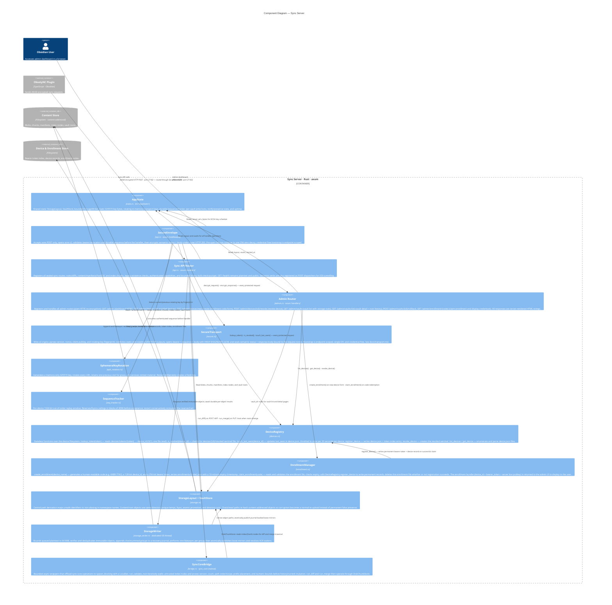

# C4 Level 3 — Sync Server Components

This diagram zooms inside the **Sync Server** container from Level 2 and shows every Rust module, what each one does, and how they collaborate. The external containers that the server reads/writes are shown at the boundary.

---


```mermaid
C4Component
    title Component Diagram — Sync Server

    Person(user, "Obsidian User", "Accesses admin dashboard in a browser.")

    Container_Ext(plugin, "ObsetyNC Plugin", "TypeScript · Obsidian", "Sends AEAD-encrypted sync requests.")
    ContainerDb_Ext(content_store, "Content Store", "Filesystem · content-addressed", "Blobs, chunks, manifests, index nodes, vault roots.")
    ContainerDb_Ext(device_store, "Device & Enrollment Store", "Filesystem", "Bearer token index, device records, enrollment codes.")

    Container_Boundary(b_server, "Sync Server · Rust · axum") {
        Component(app_state, "AppState", "state.rs · Arc<AppState>", "Shared state: StorageLayout, VaultStore, bounded StorageWriter, static X25519 key bytes, rotating in-memory transport keys, durable SequenceTracker, per-vault write locks, notify/presence state, and uptime.")

        Component(secure_envelope, "SecureEnvelope", "api.rs · axum middleware", "Accepts wire POST only, opens wire v2, validates bearer/revocation and durable sequence before the handler, then encrypts semantic status + body under outer HTTP 200. Pre-open failures collapse to one 256-zero decoy; credential-free bootstrap is endpoint-scoped.")

        Component(sync_router, "Sync API Router", "api.rs · axum handlers", "Registers all sealed sync routes: roots/diffs, content/manifests/FastCDC and index chunks, legacy existence checks, authenticated capabilities, and bounded binary bulk check/put/get. GET /health remains plaintext and public. Semantic verbs are also registered as POST dispatchers for iOS tunnelling.")

        Component(admin_router, "Admin Router", "admin.rs · axum handlers", "Registers and handles all admin routes (plain HTTP, no encryption): GET /admin (dashboard HTML), GET /admin/devices (list enrolled devices), GET /admin/devices/new (create enrollment code form), POST /admin/devices/{id}/revoke (revoke device), GET /admin/vaults (vault list with storage stats), GET /admin/vaults/{id} (vault detail + root history), POST /admin/vaults/{id}/rollback, GET /admin/enrollment/{code} (claim enrollment and display credentials). All responses are server-rendered HTML strings.")

        Component(secure_transport, "SecureTransport", "secure.rs", "Wire-v2 crypto: parses version, nonce, client pubkey, and rotating-key fingerprint; combines static and rotating X25519 DH outputs; opens bearer + sequence + body with HKDF-SHA256/AES-GCM; and seals semantic status + response body bound to the request nonce. Bootstrap is endpoint-scoped, single-DH, and credential-free. See docs/transport.md.")

        Component(eph_rotation, "EphemeralKeyRotation", "eph_rotation.rs", "Generates a memory-only X25519 key, rotates every 24h, retains one previous slot for grace, and zeroizes retired material. Restart deliberately creates a fresh key.")

        Component(sequence_tracker, "SequenceTracker", "seq_tracker.rs", "Per-device 1024-bit out-of-order replay window. Reserves/fsyncs ceilings in blocks of 4096 before acceptance; restart conservatively consumes the reserved tail.")

        Component(device_registry, "DeviceRegistry", "devices.rs", "Stateless functions over the device filesystem. lookup_token(token) — reads devices/tokens/{token} → device_id (O(1), one file read). is_revoked(device_id) — checks for devices/{id}/revoked sentinel file. touch_last_seen(device_id) — updates last_seen in device.json, throttled to once per 30 seconds per device. register_device — writes device.json + token index entry. revoke_device — creates the revoked sentinel. list_devices / get_device — enumerate and parse device.json files.")

        Component(enrollment_mgr, "EnrollmentManager", "enrollment.rs", "create_enrollment(device_name) — generates a human-readable code (e.g. AXBR-7742), a 128-bit device_id, and a 256-bit bearer token; writes enrollments/{code}.json with a 10-minute expiry timestamp. claim_enrollment(code) — reads and validates the enrollment file, checks expiry, calls DeviceRegistry.register_device to write permanent records, deletes the enrollment file whether or not registration succeeds. The enrollment bundle (device_id + bearer_token + server box pubkey) is returned to the admin UI to display to the user.")

        Component(storage, "StorageLayout + VaultStore", "storage.rs", "Central path derivation maps unsafe identifiers to non-aliasing in-namespace names. Content/root objects use same-directory unique temps, fsync, atomic promotion, and directory sync. Check/read paths re-hash content-addressed objects so corruption becomes a normal re-upload instead of permanent false presence.")

        Component(storage_writer, "StorageWriter", "storage_writer.rs · dedicated OS thread", "Bounds queued plaintext to 64 MiB, verifies and deduplicates immutable objects, appends checksummed groups to a recovery journal, performs one fdatasync per group, then atomically publishes loose mirrors and resolves ACK waiters.")

        Component(sync_core_bridge, "SyncCoreBridge", "bridge.rs · sync_core (native)", "Bounded async wrappers that offload sync-core operations to spawn_blocking with a LocalSet. run_validate_root iteratively walks untrusted index nodes and proves version, count, path order/scope, prefix placement, and numeric bounds before history/current mutation. run_diff and run_merge then operate through DiskChunkStore.")
    }

    Rel(plugin, sync_router, "Sync API calls", "AEAD-encrypted HTTP POST · port 27182 — routed through SecureEnvelope")
    Rel(user, admin_router, "Admin dashboard", "Plain HTTP · port 27183")

    Rel(secure_envelope, secure_transport, "decrypt_request() · encrypt_response() — every protected request")
    Rel(secure_envelope, device_registry, "lookup_token() · is_revoked() · touch_last_seen() — every protected request")
    Rel(secure_envelope, app_state, "Reads server_priv_bytes for ECDH key schedule")
    Rel(secure_envelope, eph_rotation, "Selects current/previous rotating key by fingerprint")
    Rel(secure_envelope, sequence_tracker, "Consumes authenticated sequence before handler")

    Rel(sync_router, app_state, "Reads layout and vaults for all handler operations")
    Rel(sync_router, storage_writer, "Enqueue verified immutable objects; await durable per-object results")
    Rel(sync_router, storage, "Read blobs, chunks, manifests, index nodes, and vault roots")
    Rel(sync_router, sync_core_bridge, "run_diff() on POST /diff · run_merge() on PUT /root when roots diverge")

    Rel(admin_router, app_state, "Reads layout, vaults, started_at")
    Rel(admin_router, device_registry, "list_devices() · get_device() · revoke_device()")
    Rel(admin_router, enrollment_mgr, "create_enrollment() on new-device form · claim_enrollment() on code redemption")
    Rel(admin_router, storage, "vault_dir stats for vault list and detail pages")

    Rel(enrollment_mgr, device_registry, "register_device() — writes permanent bearer token + device record on successful claim")

    Rel(sync_core_bridge, storage, "DiskChunkStore: reads index/{hash} nodes for diff and merge traversal")

    Rel(storage_writer, storage, "Derive object paths; atomically publish journal-backed loose mirrors")
    Rel(storage_writer, content_store, "Append and fdatasync recovery groups; materialize mirrors")

    Rel(storage, content_store, "Read / write via std::fs — blobs, manifests, chunks, index nodes, vault roots")
    Rel(storage, device_store, "Read / write via std::fs — device records, token index, enrollment files")

    UpdateLayoutConfig($c4ShapeInRow="4", $c4BoundaryInRow="1")
```

---

## Components

| Component | Source | Role |
|-----------|--------|------|
| **AppState** | `state.rs` | The shared `Arc<AppState>` holds layout/vault storage, static key bytes, rotating key state, the replay tracker, per-vault async commit locks, notification/presence maps, and uptime. The rotating private key is never persisted. |
| **SecureEnvelope** | `api.rs` (middleware fn) | An axum Tower middleware applied with `.layer(from_fn_with_state(..., secure_envelope))` to the `protected` router. Runs as a pre/post wrapper around each handler. The critical detail: all sync requests arrive as HTTP `POST` (iOS `requestUrl` drops the body on `GET`), but axum's per-method routing dispatches before middleware can rewrite the method. Fix: each semantic route also registers a `POST` dispatcher that reads `X-Obsetync-Method` and delegates to the correct handler. The middleware then restores `parts.method` for logging. |
| **Sync API Router** | `api.rs` (handler fns) | Handles `root`, `diff`, content/manifests, FastCDC and index chunks, history/rollback, legacy existence checks, sealed capabilities, and the three `bulk-http-v1` binary endpoints. Bulk codecs reject malformed lengths, flags, counts, cursors, padding, and trailing data before allocation; handlers independently verify every content address and manifest dependency. Packs preserve record order, return one mixed ACK status per object, and cursor downloads stay within the authenticated client budget. `put_root` still proves the complete bounded tree and all content references before fast-forward or three-way merge. |
| **Admin Router** | `admin.rs` (handler fns) | All responses are Rust format-string HTML — no templating engine. `create_enrollment` is triggered by the "Add Device" page; the generated code is shown once. `claim_enrollment` is the URL the user visits on their Obsidian device; it calls `EnrollmentManager.claim_enrollment`, then renders the `device_id`, `bearer_token`, and `server_box_pub` as copyable fields. The admin port (27183) is intentionally plain HTTP — it is meant to be accessed only over a trusted network or VPN. |
| **SecureTransport** | `secure.rs` | Pure wire-v2 crypto. `decrypt_request` opens the 53-byte header plus ciphertext using double DH, extracts bearer/sequence/body, and returns short-lived response key material. `encrypt_response` encrypts a two-byte semantic status and body with response AAD bound to the exact request nonce. The all-zero fingerprint selects the credential-free, endpoint-scoped bootstrap schedule. Full byte layout and threat limits are in `transport.md`. |
| **EphemeralKeyRotation** | `eph_rotation.rs` | Keeps current plus one previous memory-only X25519 key. `server-eph` publishes the current public key together with authenticated implemented capabilities and hard limits; clients bootstrap against the pinned static key after restart/expiry. |
| **SequenceTracker** | `seq_tracker.rs` | Rejects zero, duplicate, and stale authenticated sequences while allowing 1024 positions of reordering. A 4096-number ceiling is fsynced before the first value in that block is accepted; gaps after crashes are safe. |
| **DeviceRegistry** | `devices.rs` | Every function is a direct filesystem operation. `lookup_token` is intentionally O(1): it reads one file at `devices/tokens/{token}` and gets back the `device_id`. `is_revoked` checks for the existence of a `revoked` sentinel file — no locking, no DB. `touch_last_seen` is throttled (30-second minimum gap) so a large push that triggers hundreds of route calls doesn't rewrite `device.json` hundreds of times. |
| **EnrollmentManager** | `enrollment.rs` | Generates a human-readable code like `AXBR-7742` (4 uppercase letters + hyphen + 4 digits) to avoid ambiguous characters. The bearer token is 32 cryptographically random bytes (hex-encoded, 64 chars). The enrollment file is deleted on both successful and failed claim attempts — codes cannot be retried. The admin UI's `/admin/enrollment/{code}` route is what the user opens on their phone; the Obsidian plugin's enrollment flow calls this same endpoint. |
| **StorageLayout + VaultStore** | `storage.rs` | Derives all paths and prevents untrusted IDs from escaping their namespace; unsafe names are mapped under a `~` prefix that no literal safe identifier can use. Blobs and root history use same-directory temp files, file `fsync`, atomic rename, and directory `fsync`. Corrupt objects are replaceable, while the first valid metadata recorded for an existing semantic root is immutable. `current` is the small mutable root pointer. Hash-aware checks and reads treat corrupted content/index objects as missing or reject them closed. |
| **StorageWriter** | `storage_writer.rs` | A dedicated blocking thread owns the immutable-object journal. The API has a 64 MiB byte reservation and bounded message channel; full queues fail immediately with retryable backpressure. Valid records are deduplicated, appended as a checksummed group, and acknowledged only after one `fdatasync`. Atomic loose mirrors are published afterward without per-object barriers. Startup replays complete groups, recreates missing mirrors, truncates only a torn final group, and rejects corruption in a complete group. This transitional read backend is replaced by indexed segments in the next storage slice. |
| **SyncCoreBridge** | `bridge.rs` | An async shim around `!Send` sync-core futures using `spawn_blocking`, a current-thread runtime, and `LocalSet`. Besides diff/merge, `run_validate_root` performs an iterative, allocation-bounded traversal of an uploaded root: it validates all node types and prefixes, strict path order and vault-relative path safety, declared file count, JS-safe metadata, and global node/entry limits. The shared loader explicitly path-sorts flattened entries, including internal nodes with more than ten lexicographically named children. |

---

## Key Data Flows

### Every protected sync request
```
Plugin HTTP POST
  → SecureEnvelope
      → SecureTransport.decrypt_request()   # X25519 + HKDF + AES-GCM
      → DeviceRegistry.lookup_token()       # O(1) file read
      → DeviceRegistry.is_revoked()         # sentinel file check
      → SequenceTracker.check_and_record()  # replay window + block reservation
      → DeviceRegistry.touch_last_seen()    # throttled JSON write
      → [restore semantic HTTP method]
      → inner handler (SyncRouter)
      → SecureTransport.encrypt_response()  # AES-GCM with response_key
  ← Encrypted HTTP 200
```

### Pull (POST /api/v1/diff/{vault_id})
```
SyncRouter.post_diff
  → VaultStore.get_current_root()       # read vaults/{id}/current
  → VaultStore.get_root(current_hash)   # read current root bytes
  → VaultStore.get_root(device_hash)    # read device's last-known root bytes
  → SyncCoreBridge.run_diff()
      → DiskChunkStore reads index/{hash} for each tree traversal step
      → sync_core::diff::compute_deltas() — two-pointer O(n+m) merge
  → serialize FileDelta[] as JSON with hashes as hex strings
```

### Push (PUT /api/v1/root/{vault_id})
```
SyncRouter.put_root
  → deserialize + run_validate_root()       # bounded tree/path/count validation
  → verify every referenced content object exists
  → VaultStore.get_current_root()       # read current server root
  if parent_root_hash == current_root:
    → VaultStore.store_root()           # append accepted state to per-vault history
    → VaultStore.set_current_root()     # atomic rename
  else:
    → SyncCoreBridge.run_merge()        # three-way merge (base=parent, a=server, b=incoming)
        → DiskChunkStore reads index nodes for both sides
        → sync_core::merge::merge_trees()
    → write incoming + merged root bytes to per-vault history
    → VaultStore.set_current_root()     # point current at merged root
    → return {merged: true, conflicts: [...], auto_resolved: N}
```

---

## What is out of scope at this level

- The sync-core algorithms (tree structure, diff two-pointer merge, three-way merge logic) — see [c4-3-wasm.md](c4-3-wasm.md) (the same Rust code, different build target)
- The cryptographic wire protocol in detail — see [transport.md](transport.md)
- The plugin's component breakdown — see [c4-3-plugin.md](c4-3-plugin.md)
