```mermaid
C4Component
    title Component Diagram — sync-core WASM

    Container_Ext(plugin, "ObsetyNC Plugin", "TypeScript · Obsidian", "Calls all WASM-exposed functions. Crosses the JS↔WASM boundary once per operation group.")
    Container_Ext(server_bridge, "SyncCoreBridge (in Sync Server)", "bridge.rs · native Rust build", "Uses the native (non-WASM) build of sync-core. Calls compute_deltas and merge_trees with a DiskChunkStore backed by the index/ directory.")

    Container_Boundary(b_wasm, "sync-core WASM · Rust → wasm32-unknown-unknown · base64-inlined in plugin/main.js") {
        Component(wasm_bindings, "WASM Bindings + WasmTree + Hasher", "wasm.rs · #[wasm_bindgen]", "The sole public surface of the WASM module. Exports: wasm_hash, wasm_hash_batch, wasm_chunk_file, wasm_get_file_chunk, wasm_root_hash_from_bytes, wasm_should_chunk, wasm_tree_get_chunk, wasm_tree_chunk_hashes. WasmTree class: load_root, root_hash_hex, root_bytes, update_entry, delete_entry, update_batch, delete_batch, build_from_entries. Hasher class: streaming Blake3 in 64 KB slices (keeps WASM heap bounded). run_local() is a handwritten single-poll executor for driving MemoryChunkStore's async ops synchronously.")

        Component(tree_builder, "TreeBuilder", "tree.rs", "build_tree(store, entries, vault_id, device_id): groups entries by top-level prefix (BTreeMap), splits each group into LeafChunks of up to TARGET_CHUNK_ENTRIES=1000, creates an InternalNode when a prefix has multiple leaf chunks, stores all nodes in ChunkStore, returns RootNode. update_tree(store, root, upserts, deletes): two-pointer O(N+prefix) incremental update — loads only changed prefix groups, re-chunks their entries, replaces nodes in store. Operates only on the prefixes actually touched by the batch.")

        Component(diff_engine, "DiffEngine", "diff.rs · native build only", "compute_deltas(store, from_root, to_root): two-pointer merge over both roots' sorted child prefix lists. Same prefix, different hash: materialize both entry lists via load_all_entries and diff them inline. Prefix only in from: emit Deleted for every entry. Prefix only in to: emit Added for every entry. After raw deltas: detect_renames pairs every Deleted+Added that share the same content hash. Returns Vec<FileDelta>. Not exposed via WASM bindings — called only by SyncCoreBridge in the native server build.")

        Component(merge_engine, "MergeEngine", "merge.rs · native build only", "merge_trees(store, base, side_a, side_b): union of all three roots' prefixes. For each prefix: both same as base → keep base; only A changed → take A (auto-resolve); only B changed → take B (auto-resolve); both changed → diff file-level entries, call merge_file_entries for per-file resolution, collect FileConflict for unresolvable cases. Calls build_tree on the merged entry list to produce the new RootNode. Returns MergeResult{new_root, file_conflicts, auto_resolved_count}. Not exposed via WASM bindings — called only by SyncCoreBridge in the native server build.")

        Component(fastcdc_chunker, "FastCDC Chunker", "fastcdc_chunker.rs · fastcdc v2020", "chunk_file(data): runs FastCDC::new(data, 64KB, 256KB, 1MB) over the full file bytes. For each chunk: hash_bytes(chunk_bytes) → ChunkRef{hash, offset, size}. Returns ChunkedFile{manifest: FileManifest{file_hash, total_size, chunks}, chunk_data: Vec<(FileHash, Vec<u8>)>}. reassemble_file: inverse, verifies per-chunk hash and final file hash. should_chunk: returns true if size ≥ 1 MB. Content-defined boundaries mean a one-byte edit to a 200 MB file changes at most 2–3 adjacent chunks.")

        Component(blake3_hasher, "Blake3Hasher", "hash.rs · blake3 crate", "hash_bytes(data) → FileHash ([u8; 32]). Used for file content, chunk bytes, tree node serialisations — every identity in the system. IncrementalHasher: update/update_str/update_u64/finalize, used inside chunk.rs to compute node hashes from structured fields. hash_to_hex / hex_to_hash for wire-format conversion. ZERO_HASH sentinel for empty state. The Hasher WASM class (wasm.rs) wraps blake3::Hasher for streaming 64 KB slices from the plugin.")

        Component(flatbuf_codec, "FlatBuffers Codec", "chunk.rs · sync_schema crate", "Rust structs: FileEntry{path, hash, mtime_ms, size_bytes}, LeafChunk{entries: Vec<FileEntry>}, InternalNode{children: Vec<(prefix, FileHash)>}, RootNode{vault_id, created_ms, version, children, total_files, parent_hash, device_id}. Each struct: serialize() → Vec<u8> via FlatBufferBuilder, deserialize(&[u8]) → Result. RootNode.hash() and LeafChunk.hash() compute Blake3(serialize()) — the content hash IS the hash of the canonical serialisation. FileEntry is Ord by path (alphabetic, stable sort for determinism).")

        Component(chunk_store, "ChunkStore trait + MemoryChunkStore", "store.rs", "ChunkStore trait: async has/get/put/delete over FileHash keys. ?Send bound (WASM is single-threaded). MemoryChunkStore: RefCell<HashMap<FileHash, Vec<u8>>> — the WasmTree's backing store. insert_chunk / get_chunk / all_chunk_hashes are extra synchronous methods used directly by wasm.rs. DiskChunkStore: std::fs-backed, sharded by hash[0:2] — used only in the native server build via SyncCoreBridge. MemoryChunkStore never returns Pending, making run_local() safe to use as a single-poll executor.")
    }

    Rel(plugin, wasm_bindings, "All plugin WASM calls cross here", "JS → WASM boundary — one call per operation group")
    Rel(server_bridge, diff_engine, "compute_deltas() — native build only", "via DiskChunkStore reading index/ directory")
    Rel(server_bridge, merge_engine, "merge_trees() — native build only", "via DiskChunkStore reading index/ directory")

    Rel(wasm_bindings, tree_builder, "WasmTree.build_from_entries → build_tree · WasmTree.update_batch / delete_batch → update_tree")
    Rel(wasm_bindings, fastcdc_chunker, "wasm_chunk_file → chunk_file · wasm_should_chunk → should_chunk")
    Rel(wasm_bindings, blake3_hasher, "wasm_hash / wasm_hash_batch → hash_bytes · Hasher class wraps blake3::Hasher")
    Rel(wasm_bindings, chunk_store, "WasmTree holds MemoryChunkStore · wasm_tree_get_chunk / wasm_tree_chunk_hashes query it directly")
    Rel(wasm_bindings, flatbuf_codec, "wasm_root_hash_from_bytes → RootNode::deserialize")

    Rel(tree_builder, chunk_store, "put (store new nodes) · get (load existing nodes for update)")
    Rel(tree_builder, flatbuf_codec, "LeafChunk/InternalNode/RootNode serialize/deserialize for every tree read and write")
    Rel(tree_builder, blake3_hasher, "hash_bytes(node.serialize()) to compute each node's content hash")

    Rel(diff_engine, chunk_store, "get — load LeafChunk and InternalNode bytes for both tree sides")
    Rel(diff_engine, flatbuf_codec, "deserialize nodes to compare FileEntry lists")

    Rel(merge_engine, chunk_store, "get — load all three tree versions' nodes")
    Rel(merge_engine, tree_builder, "build_tree — assemble merged entries into a new RootNode after all prefixes resolved")
    Rel(merge_engine, flatbuf_codec, "deserialize entries from all three sides for per-file merge")

    Rel(fastcdc_chunker, blake3_hasher, "hash_bytes per chunk boundary + whole-file hash")
    Rel(flatbuf_codec, blake3_hasher, "hash_bytes(serialize()) — node identity derived from content")

    UpdateLayoutConfig($c4ShapeInRow="4", $c4BoundaryInRow="1")
```

# C4 Level 3 — sync-core WASM Components

This diagram zooms inside the **sync-core WASM** container from Level 2 and shows every Rust module, what each one does, and how they call each other. Two important points that are not obvious from the module list alone:

1. **`diff.rs` and `merge.rs` compile into the WASM binary but are never called through WASM bindings.** The plugin gets deltas from the server over HTTP — it never runs `compute_deltas` locally. The diff and merge algorithms only run server-side, via the native (non-WASM) build of the same crate, called from `bridge.rs`.

2. **`wasm.rs` contains a handwritten single-poll executor (`run_local`)** that drives async tree operations synchronously. WASM is single-threaded; `MemoryChunkStore` has no real I/O and never returns `Poll::Pending`, so a single `poll()` call always completes. This lets the tree code use `async fn + ChunkStore` uniformly across WASM and native without a special-case path.

---



---

## Components

| Component | Source | Role |
|-----------|--------|------|
| **WASM Bindings + WasmTree + Hasher** | `wasm.rs` | The only module compiled with `#[cfg(feature = "wasm")]`. Everything the plugin can call lives here. `WasmTree` is a stateful WASM class that owns both the current `RootNode` and the `MemoryChunkStore` that backs it. `run_local()` is a minimal single-poll executor: it creates a no-op `Waker`, pins the future, calls `poll()` once, and panics on `Pending` (which `MemoryChunkStore` never returns). This avoids pulling in a full async runtime for WASM. |
| **TreeBuilder** | `tree.rs` | Pure tree manipulation — no I/O except through the `ChunkStore` trait. `build_tree` does a full construction from a flat `Vec<FileEntry>`: group by top-level prefix via `BTreeMap`, split each group into `LeafChunk` segments of ≤1000 entries, promote to `InternalNode` if a prefix overflows one leaf, store all node bytes in the store, return the `RootNode`. `update_tree` is the incremental path: it only touches prefixes that contain a changed file, re-chunks those prefixes from their current on-store entries plus the new/deleted entries, and writes the replacement nodes. Unchanged prefixes are referenced by existing hashes with no I/O. |
| **DiffEngine** | `diff.rs` | Two-pointer merge over `from_root.children` and `to_root.children` (both sorted by prefix, guaranteed by `BTreeMap` insertion order). Only loads entries for prefixes whose hash changed. After collecting raw `Added/Modified/Deleted` deltas: `detect_renames` scans for `Deleted+Added` pairs sharing a content hash and converts them to `Renamed`. The whole algorithm is O(changed subtrees × entries-per-chunk), not O(total files). **Not reachable from the plugin via WASM** — the plugin calls `ObsetyncApi.getDiff` instead. |
| **MergeEngine** | `merge.rs` | Three-way merge at the prefix level. Takes `base` (common ancestor — the `parent_hash` from the incoming push), `side_a` (current server root), `side_b` (incoming push). Single-side changes are auto-resolved without touching the file level. Both-sides changes go to `merge_file_entries`, which merges per-path: auto-resolves if only one side changed the file, emits `FileConflict` if both sides changed the same file differently. The conflict resolution strategy (from `sync_rules.rs`) determines whether to keep-both, keep-latest, or error. After all prefixes: calls `build_tree` to materialise the merged entries into a new `RootNode`. **Not reachable from the plugin via WASM.** |
| **FastCDC Chunker** | `fastcdc_chunker.rs` | Wraps the `fastcdc` v2020 crate. The key property is content-defined cut points: boundaries are determined by a rolling hash of the content bytes, not by fixed offsets. A one-byte change to a 200 MB PDF shifts at most 2–3 chunk boundaries — all other chunks are byte-identical and deduplicate across versions. `reassemble_file` reconstructs by concatenating chunks in manifest order and verifying the final Blake3 hash matches `manifest.file_hash`. |
| **Blake3Hasher** | `hash.rs` | `FileHash = [u8; 32]` is used as the identity type everywhere: file content, chunk bytes, tree nodes. All equality comparisons in the tree (diff, merge, chunk lookup) reduce to `[u8; 32] == [u8; 32]`. `IncrementalHasher` is used inside `chunk.rs` to compute node hashes from structured fields in a deterministic order. The streaming `Hasher` WASM class is the memory-safe path for large files: each `update(64KB)` call keeps the WASM linear memory flat, avoiding the growth-to-full-file-size that a single `wasm_hash(entireFile)` call would cause. |
| **FlatBuffers Codec** | `chunk.rs` + `crates/sync-schema` | The canonical on-wire and on-disk format for all tree nodes. FlatBuffers was chosen over JSON or bincode because it allows zero-copy reads on the server side and produces byte-identical output for the same logical tree (determinism is required for content-addressed hashing). `RootNode.hash()` is `blake3(self.serialize())` — the hash is a commitment to the exact bytes. `FileEntry` implements `Ord` by `path` so leaf chunks are always sorted the same way regardless of insertion order. |
| **ChunkStore / MemoryChunkStore** | `store.rs` | The `ChunkStore` trait is the single seam between the tree algorithms and their storage backends. `?Send` trait bound (required because WASM is single-threaded and futures must not be `Send`). In WASM: `MemoryChunkStore` — an in-memory `RefCell<HashMap>` that the `WasmTree` instance owns. All reads and writes complete synchronously, enabling `run_local()` to safely poll once. In the server native build: `DiskChunkStore` — reads from and writes to `index/<hash[0:2]>/<hash[2:]>` files. The same tree/diff/merge code runs against both stores without modification. |

---

## Build targets: WASM vs native

The same `sync-core` source compiles to two different targets that are used in two different places:

| Target | Built by | Used by | ChunkStore | Exposed APIs |
|--------|----------|---------|-----------|--------------|
| `wasm32-unknown-unknown` (WASM feature) | `wasm-pack build --target web` | ObsetyNC Plugin (base64-inlined in main.js) | `MemoryChunkStore` | All `#[wasm_bindgen]` exports in `wasm.rs` |
| Native (`x86_64-linux` or similar) | `cargo build --release` | Sync Server (linked into binary) | `DiskChunkStore` | Direct Rust function calls via `bridge.rs` |

The WASM build exposes: `WasmTree`, `Hasher`, `wasm_hash`, `wasm_hash_batch`, `wasm_chunk_file`, `wasm_get_file_chunk`, `wasm_root_hash_from_bytes`, `wasm_should_chunk`, `wasm_tree_get_chunk`, `wasm_tree_chunk_hashes`.

The native build exposes (to `bridge.rs`): `sync_core::diff::compute_deltas`, `sync_core::merge::merge_trees`, `sync_core::store::DiskChunkStore`.

`diff.rs` and `merge.rs` are compiled into the WASM binary but all their code is unreachable from JavaScript and will be eliminated by `wasm-opt` dead-code elimination during the release build.

---

## Key Data Flows

### Push: hash N small files (one WASM boundary crossing)
```
plugin: wasm_hash_batch(concatBytes, offsets, sizes)
  → WasmBindings.wasm_hash_batch
      → for each (offset, size): blake3::hash(&data[offset..offset+size]) → hex string
  ← [hex_1, hex_2, ..., hex_N]
```

### Push: chunk a large file (≥ 1 MB)
```
plugin: wasm_chunk_file(fileBytes)
  → WasmBindings.wasm_chunk_file
      → FastCDCChunker.chunk_file(fileBytes)
          → FastCDC rolling hash → chunk boundaries
          → Blake3Hasher.hash_bytes(chunkBytes) for each chunk
          → Blake3Hasher.hash_bytes(fileBytes) for file_hash
  ← JS object: { file_hash, total_size, chunks: [{hash, offset, size}] }

plugin: wasm_get_file_chunk(fileBytes, offset, size)
  → slice data[offset..offset+size]  # one chunk's bytes, no re-chunking
  ← Uint8Array
```

### Push: update tree after all file uploads
```
plugin: wasmTree.update_batch(entriesJSON)
  → WasmBindings → run_local(tree::update_tree(store, root, entries, []))
      → group entries by top-level prefix
      → for each changed prefix:
          → chunk_store.get(existing_leaf_hash) → deserialize → load existing entries
          → merge with new/updated entries (sorted)
          → FlatBuffersCodec: serialize new LeafChunk → Blake3Hasher.hash_bytes → store.put
          → if multiple leaves: serialize InternalNode → store.put
      → FlatBuffersCodec: serialize new RootNode (no store.put — caller holds it in memory)
  ← () [root updated in WasmTree.root field]

plugin: wasmTree.root_bytes() → Uint8Array  # serialized RootNode for upload
plugin: wasm_tree_chunk_hashes(tree)         # all node hashes for checkChunks
plugin: wasm_tree_get_chunk(tree, hash)      # get individual node bytes for upload
```

### Server diff (native build)
```
SyncCoreBridge.run_diff(index_base, from_root, to_root)
  → spawn_blocking + LocalSet
      → DiskChunkStore::new(index_base)
      → diff::compute_deltas(disk_store, from_root, to_root)
          → two-pointer over sorted prefix children
          → for changed prefix: DiskChunkStore.get(hash) → FlatBuffersCodec.deserialize → diff entries
          → detect_renames: pair Deleted+Added with same hash
  ← Vec<FileDelta>
```

---

## What is out of scope at this level

- How the plugin invokes these functions — see [c4-3-plugin.md](c4-3-plugin.md)
- How the server invokes diff and merge — see [c4-3-server.md](c4-3-server.md)
- The cryptographic transport — see [transport.md](transport.md)
- The FlatBuffers schema definition — see `crates/sync-schema/schema/chunk.fbs`
