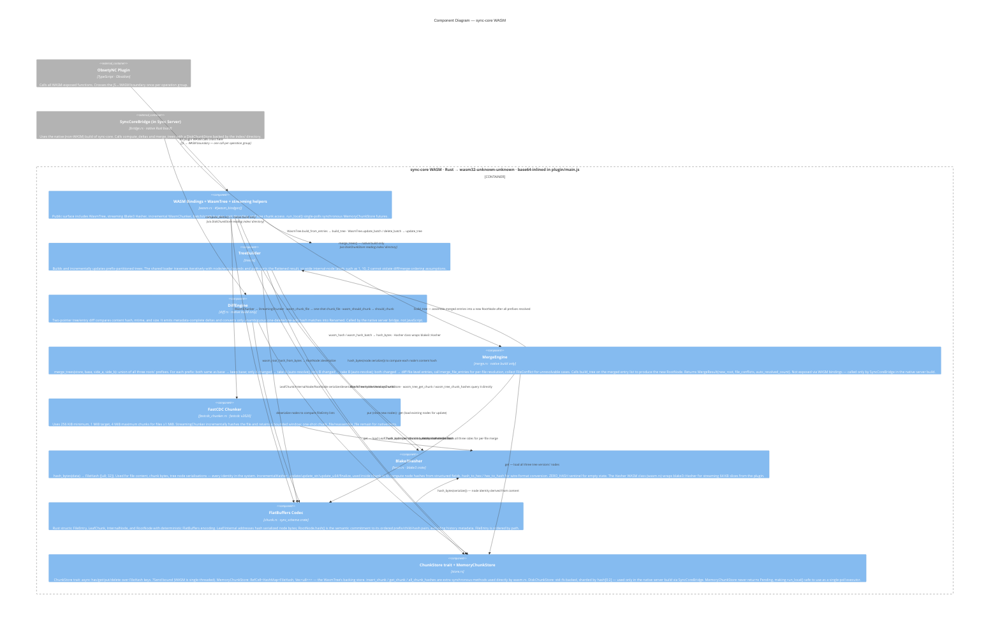

# C4 Level 3 — sync-core WASM Components

This diagram zooms inside the **sync-core WASM** container from Level 2 and shows every Rust module, what each one does, and how they call each other. Two important points that are not obvious from the module list alone:

1. **`diff.rs` and `merge.rs` compile into the WASM binary but are never called through WASM bindings.** The plugin gets deltas from the server over HTTP — it never runs `compute_deltas` locally. The diff and merge algorithms only run server-side, via the native (non-WASM) build of the same crate, called from `bridge.rs`.

2. **`wasm.rs` contains a handwritten single-poll executor (`run_local`)** that drives async tree operations synchronously. WASM is single-threaded; `MemoryChunkStore` has no real I/O and never returns `Poll::Pending`, so a single `poll()` call always completes. This lets the tree code use `async fn + ChunkStore` uniformly across WASM and native without a special-case path.

---


```mermaid
C4Component
    title Component Diagram — sync-core WASM

    Container_Ext(plugin, "ObsetyNC Plugin", "TypeScript · Obsidian", "Calls all WASM-exposed functions. Crosses the JS↔WASM boundary once per operation group.")
    Container_Ext(server_bridge, "SyncCoreBridge (in Sync Server)", "bridge.rs · native Rust build", "Uses the native (non-WASM) build of sync-core. Calls compute_deltas and merge_trees with a DiskChunkStore backed by the index/ directory.")

    Container_Boundary(b_wasm, "sync-core WASM · Rust → wasm32-unknown-unknown · base64-inlined in plugin/main.js") {
        Component(wasm_bindings, "WASM Bindings + WasmTree + streaming helpers", "wasm.rs · #[wasm_bindgen]", "Public surface includes WasmTree, streaming Blake3 Hasher, incremental WasmChunker, batch/single hashes, root decoding, and tree chunk access. run_local() single-polls synchronous MemoryChunkStore futures.")

        Component(tree_builder, "TreeBuilder", "tree.rs", "Builds and incrementally updates prefix-partitioned trees. The shared loader traverses iteratively with node/entry bounds and path-sorts the flattened result, so wide internal-node labels such as 1, 10, 2 cannot violate diff/merge ordering assumptions.")

        Component(diff_engine, "DiffEngine", "diff.rs · native build only", "Two-pointer tree/entry diff compares content hash, mtime, and size. It emits metadata-complete deltas and converts only unambiguous one-delete/one-add hash matches into Renamed. Called by the native server bridge, not JavaScript.")

        Component(merge_engine, "MergeEngine", "merge.rs · native build only", "merge_trees(store, base, side_a, side_b): union of all three roots' prefixes. For each prefix: both same as base → keep base; only A changed → take A (auto-resolve); only B changed → take B (auto-resolve); both changed → diff file-level entries, call merge_file_entries for per-file resolution, collect FileConflict for unresolvable cases. Calls build_tree on the merged entry list to produce the new RootNode. Returns MergeResult{new_root, file_conflicts, auto_resolved_count}. Not exposed via WASM bindings — called only by SyncCoreBridge in the native server build.")

        Component(fastcdc_chunker, "FastCDC Chunker", "fastcdc_chunker.rs · fastcdc v2020", "Uses 256 KiB minimum, 1 MiB target, 4 MiB maximum chunks for files ≥1 MiB. StreamingChunker incrementally hashes the file and retains a bounded window; one-shot chunk_file/reassemble_file remain for native/tests.")

        Component(blake3_hasher, "Blake3Hasher", "hash.rs · blake3 crate", "hash_bytes(data) → FileHash ([u8; 32]). Used for file content, chunk bytes, tree node serialisations — every identity in the system. IncrementalHasher: update/update_str/update_u64/finalize, used inside chunk.rs to compute node hashes from structured fields. hash_to_hex / hex_to_hash for wire-format conversion. ZERO_HASH sentinel for empty state. The Hasher WASM class (wasm.rs) wraps blake3::Hasher for streaming 64 KB slices from the plugin.")

        Component(flatbuf_codec, "FlatBuffers Codec", "chunk.rs · sync_schema crate", "Rust structs: FileEntry, LeafChunk, InternalNode, and RootNode with deterministic FlatBuffers encoding. Leaf/internal addresses hash serialized node bytes; RootNode.hash() is the semantic commitment to its ordered prefix/child-hash pairs, excluding history metadata. FileEntry is ordered by path.")

        Component(chunk_store, "ChunkStore trait + MemoryChunkStore", "store.rs", "ChunkStore trait: async has/get/put/delete over FileHash keys. ?Send bound (WASM is single-threaded). MemoryChunkStore: RefCell<HashMap<FileHash, Vec<u8>>> — the WasmTree's backing store. insert_chunk / get_chunk / all_chunk_hashes are extra synchronous methods used directly by wasm.rs. DiskChunkStore: std::fs-backed, sharded by hash[0:2] — used only in the native server build via SyncCoreBridge. MemoryChunkStore never returns Pending, making run_local() safe to use as a single-poll executor.")
    }

    Rel(plugin, wasm_bindings, "All plugin WASM calls cross here", "JS → WASM boundary — one call per operation group")
    Rel(server_bridge, diff_engine, "compute_deltas() — native build only", "via DiskChunkStore reading index/ directory")
    Rel(server_bridge, merge_engine, "merge_trees() — native build only", "via DiskChunkStore reading index/ directory")

    Rel(wasm_bindings, tree_builder, "WasmTree.build_from_entries → build_tree · WasmTree.update_batch / delete_batch → update_tree")
    Rel(wasm_bindings, fastcdc_chunker, "WasmChunker → StreamingChunker · wasm_chunk_file → one-shot chunk_file · wasm_should_chunk → should_chunk")
    Rel(wasm_bindings, blake3_hasher, "wasm_hash / wasm_hash_batch → hash_bytes · Hasher class wraps blake3::Hasher")
    Rel(wasm_bindings, chunk_store, "WasmTree holds MemoryChunkStore · wasm_tree_get_chunk / wasm_tree_chunk_hashes query it directly")
    Rel(wasm_bindings, flatbuf_codec, "wasm_root_hash_from_bytes → RootNode::deserialize")

    Rel(tree_builder, chunk_store, "put (store new nodes) · get (load existing nodes for update)")
    Rel(tree_builder, flatbuf_codec, "LeafChunk/InternalNode/RootNode serialize/deserialize for every tree read and write")
    Rel(tree_builder, blake3_hasher, "hash_bytes(node.serialize()) to compute each node's content hash")

    Rel(diff_engine, chunk_store, "get — load LeafChunk and InternalNode bytes for both tree sides")
    Rel(diff_engine, flatbuf_codec, "deserialize nodes to compare FileEntry lists")

    Rel(merge_engine, chunk_store, "get — load all three tree versions' nodes")
    Rel(merge_engine, tree_builder, "build_tree — assemble merged entries into a new RootNode after all prefixes resolved")
    Rel(merge_engine, flatbuf_codec, "deserialize entries from all three sides for per-file merge")

    Rel(fastcdc_chunker, blake3_hasher, "hash_bytes per chunk boundary + whole-file hash")
    Rel(flatbuf_codec, blake3_hasher, "hash_bytes(serialize()) — node identity derived from content")

    UpdateLayoutConfig($c4ShapeInRow="4", $c4BoundaryInRow="1")
```

---

## Components

| Component | Source | Role |
|-----------|--------|------|
| **WASM Bindings + WasmTree + Hasher** | `wasm.rs` | The only module compiled with `#[cfg(feature = "wasm")]`. Everything the plugin can call lives here. `WasmTree` is a stateful WASM class that owns both the current `RootNode` and the `MemoryChunkStore` that backs it. `run_local()` is a minimal single-poll executor: it creates a no-op `Waker`, pins the future, calls `poll()` once, and panics on `Pending` (which `MemoryChunkStore` never returns). This avoids pulling in a full async runtime for WASM. |
| **TreeBuilder** | `tree.rs` | Pure tree manipulation — no I/O except through the `ChunkStore` trait. `build_tree` groups by top-level prefix, splits groups into leaves of ≤1000 entries, and promotes wide groups to internal nodes. `update_tree` only re-chunks touched prefixes. `load_all_entries` is iterative rather than attacker-depth recursive, bounds visited nodes/entries, and path-sorts its final stream because lexicographic child labels (`1`, `10`, `2`) do not themselves guarantee `FileEntry` order. |
| **DiffEngine** | `diff.rs` | Two-pointer merge over sorted roots and entries. A path is modified when hash, mtime, or size changes, preventing distinct roots from yielding a false empty delta. Only an unambiguous unique deleted/added hash pair becomes `Renamed`; duplicate-content ambiguity stays delete+add. **Not reachable from the plugin via WASM**. |
| **MergeEngine** | `merge.rs` | Three-way merge at the prefix and path levels. Single-side changes auto-resolve. A two-sided same-path change provisionally keeps side A, then eligible small strict-UTF-8 files get a deterministic line-merge post-pass; overlap, binary, large, missing, or invalid content emits `FileConflict`. The returned root stays outside the byte-addressed chunk store and is persisted by the server in per-vault history. **Not reachable from the plugin via WASM.** |
| **FastCDC Chunker** | `fastcdc_chunker.rs` | Content-defined 256 KiB / 1 MiB / 4 MiB min/target/max cuts. `StreamingChunker` accepts small feeds, incrementally computes full-file and chunk hashes, avoids per-chunk `Vec::drain` memmoves, and returns only the manifest. `reassemble_file` verifies both chunks and final Blake3 address. |
| **Blake3Hasher** | `hash.rs` | `FileHash = [u8; 32]` identifies file content, chunks, and tree references. `IncrementalHasher` computes deterministic structured hashes. The streaming WASM `Hasher` keeps bridge memory bounded; `update_and_hash(slice)` updates the ordered whole-file digest and returns that slice's independent address in one JS→WASM copy, which lets pull verify both manifest chunks and the fresh assembled stream without duplicating plaintext. |
| **FlatBuffers Codec** | `chunk.rs` + `crates/sync-schema` | The canonical on-wire and on-disk format for tree nodes. Leaf and internal node addresses commit to their serialized bytes. A root hash deliberately commits only to its ordered `(prefix, child_hash)` pairs, so identical vault state has the same identity despite `created_ms`, device, parent, or other history metadata. `FileEntry` implements `Ord` by path and loaders reassert that order before two-pointer algorithms. |
| **ChunkStore / MemoryChunkStore** | `store.rs` | The `ChunkStore` trait is the single seam between the tree algorithms and their storage backends. `?Send` trait bound (required because WASM is single-threaded and futures must not be `Send`). In WASM: `MemoryChunkStore` — an in-memory `RefCell<HashMap>` that the `WasmTree` instance owns. All reads and writes complete synchronously, enabling `run_local()` to safely poll once. In the server native build: `DiskChunkStore` — reads from and writes to `index/<hash[0:2]>/<hash[2:]>` files. The same tree/diff/merge code runs against both stores without modification. |

---

## Build targets: WASM vs native

The same `sync-core` source compiles to two different targets that are used in two different places:

| Target | Built by | Used by | ChunkStore | Exposed APIs |
|--------|----------|---------|-----------|--------------|
| `wasm32-unknown-unknown` scalar (`wasm`) | `scripts/build-wasm.sh` / `wasm-pack --target web` | Universal ObsetyNC Plugin fallback (base64-inlined in main.js) | `MemoryChunkStore` | All `#[wasm_bindgen]` exports in `wasm.rs` |
| `wasm32-unknown-unknown` SIMD (`wasm-simd`, `+simd128`, `blake3/wasm32_simd`) | `scripts/build-wasm.sh` / `wasm-pack --target web` | Fast path after runtime `WebAssembly.validate`; falls back to scalar if validation or initialization fails | `MemoryChunkStore` | Identical API and byte-for-byte hash/FastCDC semantics |
| Native (`x86_64-linux` or similar) | `cargo build --release` | Sync Server (linked into binary) | `DiskChunkStore` | Direct Rust function calls via `bridge.rs` |

Both WASM builds expose: `WasmTree`, `Hasher`, `WasmChunker`, `wasm_hash`, `wasm_hash_batch`, the compatibility one-shot chunk helpers, `wasm_root_hash_from_bytes`, `wasm_should_chunk`, and tree-chunk accessors. The selected mode is cached for the plugin session and included in debug/performance diagnostics.

Streaming calls use an adaptive bounded feed: 512 KiB initially on desktop (up to 1 MiB), 256 KiB on mobile, and back down toward 64 KiB when a synchronous WASM step blocks the event loop or Chromium reports heap pressure. Feed size changes never alter hashes or FastCDC boundaries.

On desktop, `hash-worker-entry.ts` is bundled as minified CommonJS and embedded
as text in `main.js`. A bounded `worker_threads` pool starts it with `eval: true`,
so community-plugin installers still need only the standard plugin files. Each
worker owns a separate SIMD WASM instance and opens the absolute file path from
its job. The wire object contains path, expected size/mtime, feed, and
`hash|manifest` mode; results contain only digest/manifest metadata and timings.
The worker stats the open inode before processing and the pathname afterward,
rejecting drift or atomic replacement before the candidate tree can commit.

The native build exposes (to `bridge.rs`): `sync_core::diff::compute_deltas`, `sync_core::merge::merge_trees`, `sync_core::store::DiskChunkStore`.

`diff.rs` and `merge.rs` are compiled into the WASM binary but all their code is unreachable from JavaScript and will be eliminated by `wasm-opt` dead-code elimination during the release build.

---

## Key Data Flows

### Push: hash N small files (one WASM boundary crossing)
```
plugin: wasm_hash_batch(concatBytes, offsets, sizes)
  → WasmBindings.wasm_hash_batch
      → for each (offset, size): blake3::hash(&data[offset..offset+size]) → hex string
  ← [hex_1, hex_2, ..., hex_N]
```

### Push: chunk a large file (≥ 1 MB)
```
plugin: new WasmChunker(); update(fileBytes[64 KiB slices]); finish()
  → FastCDCChunker.StreamingChunker
      → retain only the unresolved bounded FastCDC window
      → incrementally Blake3-hash each emitted chunk and the complete stream
  ← JS object: { file_hash, total_size, chunks: [{hash, offset, size}] }

plugin: fileBytes.subarray(offset, offset + size)
  → upload only hashes reported missing by the server
```

### Push: update tree after all file uploads
```
plugin: wasmTree.update_batch(entriesJSON)
  → WasmBindings → run_local(tree::update_tree(store, root, entries, []))
      → group entries by top-level prefix
      → for each changed prefix:
          → chunk_store.get(existing_leaf_hash) → deserialize → load existing entries
          → merge with new/updated entries (sorted)
          → FlatBuffersCodec: serialize new LeafChunk → Blake3Hasher.hash_bytes → store.put
          → if multiple leaves: serialize InternalNode → store.put
      → FlatBuffersCodec: serialize new RootNode (no store.put — caller holds it in memory)
  ← () [root updated in WasmTree.root field]

plugin: wasmTree.root_bytes() → Uint8Array  # serialized RootNode for upload
plugin: wasm_tree_chunk_hashes(tree)         # byte-addressed leaf/internal hashes
plugin: wasm_tree_get_chunk(tree, hash)      # get individual node bytes for upload
```

### Server diff (native build)
```
SyncCoreBridge.run_diff(storage_writer, from_root, to_root)
  → bounded StorageWriter read pool + LocalSet
      → diff::compute_deltas(pack-backed store, from_root, to_root)
          → two-pointer over sorted prefix children
          → for changed prefix: indexed pack read → FlatBuffersCodec.deserialize → diff entries
          → detect_renames: pair only unique one-delete/one-add matches per hash
  ← Vec<FileDelta>
```

---

## What is out of scope at this level

- How the plugin invokes these functions — see [c4-3-plugin.md](c4-3-plugin.md)
- How the server invokes diff and merge — see [c4-3-server.md](c4-3-server.md)
- The cryptographic transport — see [transport.md](transport.md)
- The FlatBuffers schema definition — see `crates/sync-schema/schema/chunk.fbs`
